# Introduction

I provide this annotated version of the Ethereum yellow paper as a tool to help onboard engineers onto Ethereum development. Some sections of the original paper would be clearer with further context and/or with more practical examples.

The format follows the sections as written in the original paper, but with more explanations around equations, and more practical examples around complicated concepts. This annotated version hopes to provide a single document that is able to provide a good overview of the Ethereum protocol minus the hard work in understanding the equations and subtleties present.

# Section 2

> Ethereum, taken as a whole, can be viewed as a transaction-based state machine: we begin with a genesis state and incrementally execute transactions to morph it into some current state.
> 

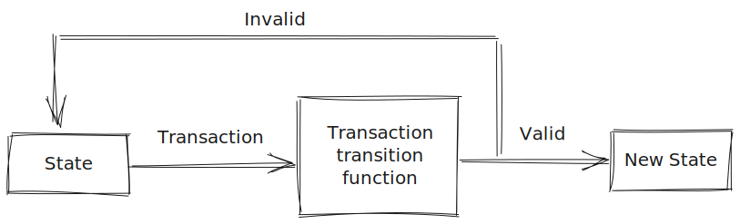

Figure 1: A visual representation of the transaction transition function

***Mathematically***:

$\boldsymbol{\sigma}_{t+1} \equiv \Upsilon(\boldsymbol{\sigma}_t, T)$

$\Upsilon$ - Ethereum state **transaction** **transition function** 

$\boldsymbol{\sigma}$ - **Ethereum state**

$T$ - A **single** transaction

> In Ethereum, $\Upsilon$, together with $\boldsymbol{\sigma}$ are considerably more powerful than any existing comparable system; $\Upsilon$ allows components to carry out arbitrary computation, while $\boldsymbol{\sigma}$ allows components to store arbitrary state between transactions.
> 

Ethereum is a general purpose computer - hence $\Upsilon$ - the state **transaction** **transition function** can transition the state in any way the developer want. Transitions are the result of transaction executions. Transactions can fall into 2 distinct types:

1. Simple value transfer - these are, as the name suggest, simple value transfers between two addresses
2. Smart contract execution - these transactions execute code that lives on the blockchain. The code may hold state - as such - through the execution of the associated code, the develop can mutate the global state $\boldsymbol{\sigma}$ in any way the develop wishes.

 Additionally, $\boldsymbol{\sigma}$   contains whatever the developer wants to store on the blockchain.

1. Names
2. Counters
3. Mappings
4. Custom data structures

** On top of a list of all the account states (more on this later).

> Transactions are collated into blocks; blocks are chained together using a cryptographic hash as a means of reference
> 


Figure 2: Block contents and how blocks are chained together

Blocks are split into 3 sections. 

1. The **block header** - $B_H$
2. The **transaction list** - $B_T$
3. The **Ommer list** - $B_U$

The **block header**, $B_H$ contains the hash of the parent block (Block #2’s header contains a hash referencing block #1, and block #3’s header contains a hash referencing block #2) .  A block can only have 1 parent, but an infinite amount of children. However, only one path is valid. 

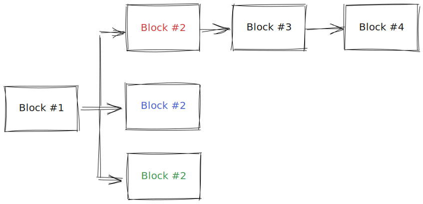

Figure 3: Orphaned blocks and blockchains of various lengths

Even though Block #1 has 3 children (the red, blue, and green block #2), only red block #2 is followed by more blocks. In essence, blue block #2 and green block #2 have been abandoned. Any transaction contained in them is invalid (can be ignored). Miners will always choose the path with the greatest amount of blocks (most work done) to work on (to append their blocks to). 

> … They (blocks) also punctuate the transaction series with incentives for nodes to mine. This incentivisation takes place as a state-transition function, adding value to a nominated account.
> 

For one’s transaction to end up being mined (put in a block and appended to the longest path) a miner must pick up that transaction and choose to include it in its block. There are many more transactors than miners. Hence, transactors can include a fee to be paid to the miner. This incentivises the miner to include that specific transaction. The bigger the fee, the more likely that more miners will include your transaction, hence, the faster your transaction will end up being mined. (Note that it is only at the point of the block being appended (mined) that the miner receives your transaction. If there are 5 miners working on your transaction, only the miner that succeeds in mining his block will receive your fee. )

The paper gives the following equations to formally define the blockchain paradigm.  

(2) $\boldsymbol{\sigma}_{t+1} \equiv \Pi(\boldsymbol{\sigma}_t, B)$

$\Pi$ is the Ethereum **block level** state transition function. 

(3) $B \equiv (..., (T_0, T_1, ...),...)$

A block contains 

1. A list of transactions $T_0, T_1, ...$
2. A block header $B_H$
3. A list of ommer block headers $B_U$

(4) $\Pi(\boldsymbol{\sigma}, B) \equiv \Omega(B, \Upsilon(\Upsilon(\boldsymbol{\sigma}, T_0), T_1)...)$

The Ethereum **block level** state transition function is defined by recursively applying the Ethereum transaction state transition function to all the transactions contained in the block (starting with the initial state, and the first transaction). Finally, the resulting state is fed into $\Omega$  - a function which applies the block rewards. (It will modify the resulting state to increment the miner’s address by the collected fees -**Note** that **t**here are various people, other than the miner, that are rewarded. It suffices to think of this function as the *reward-giving* function). 

> This (equations (2), (3), and (4)) is the basis of the blockchain paradigm, a model that forms the backbone of not only Ethereum, but all decentralised consensus-based transaction systems to date
> 

## Section 2.1 - Value

The following sub-denominations of Ether exist:  

| Multiplier | Name |
| --- | --- |
| $10^0$ | Wei |
| $10^{12}$ | Szabo |
| $10^{15}$ | Finney |
| $10^{18}$ | Ether |

Transactions are - at their lowest level - always sending a value quoted in Wei. When someone sends 1 Ether, they are sending $10^{18}$ Wei; $10^{18}$ is the value quoted in the transaction. You cannot send fractional values of Wei. 

## Section 2.2 - Which History?

The system is decentralised. Participants to the protocol may choose different paths from root to leaf to consider the canonical blockchain. Consider Figure 4

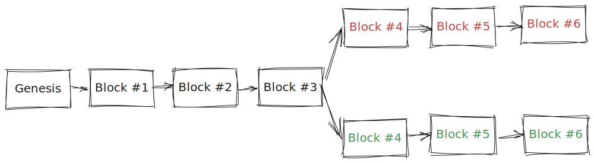

Figure 4: Participants may choose to follow different paths from “Genesis Block” to “Block #6” when working out the system state. The path each user takes is *their canonical blockchain* and is their view on what the state of the system may be.

User A may choose to follow the path starting from “Genesis Block” and ending at the “Red Block #6”, whereas user B may choose to follow the path starting from “Genesis Block”, but ending at “Green Block #6” - the path a user chooses is their canonical blockchain. All of the assets (coins, NFTs, contracts etc…) prior to the mining of block #4 will exist on both forks. However, the different transactions resulting from the 2 different forks, will interact differently with those existing assets, leading to a completely different state of the blockchain.  The paper concludes Section 2.2 by giving various *checkpoints* - in terms of block number - at which protocol changes have been made. Hence, when travelling through the history of the canonical Ethereum blockchain, one should consult this table to understand how transactions were validated, and what additional information has been added/removed.  For example, the *GrayGlacier* [protocol change](https://blog.ethereum.org/2022/06/16/gray-glacier-announcement) (activated at block number 15050000) delayed the Difficulty bomb by pushing it back 700 000 blocks (roughly 100 days). The difficulty bomb is a mechanic added to incentivise the Ethereum blockchain to move from Proof-of-Work to Proof-of-Stake (by making it incredibly computationally heavy to mine any additional transactions once the difficulty bomb kicks in). By pushing it back 700 000 blocks, the Ethereum developers gave themselves additional time to complete the work related to migrating the blockchain to Proof-of-Stake. Note that protocol changes cannot be enforced - nodes/miners may choose to ignore protocol changes. If a certain node/miner decides to ignore a protocol change then chances are blocks will appear invalid to the rest of the protocol-following community and hence the rest of the protocol-following community will follow a different canonical blockchain than the nodes/miners that decided to abstain from changing. This is what the community refers to as a hard fork between two factions.

# Section 3: Conventions

This section is crucial when it comes to understanding the rest of the paper. It introduces all the mathematical language and *slang* that will be used throughout the rest of the paper to formally define the Ethereum protocol. Here are the rules

- The paper will make reference to only 2 bold lowercase Greek letters. These symbols represent highly structured, *top-level* state values (Think tuple or list of tuples)
    - $\boldsymbol{\sigma}$ - the **World State**  - introduced in Section 4.1 (For now, think of this as a list of  tuples. The individual tuple is the account tuple - contains things such as the nonce of the account, the balance etc…)
    - $\boldsymbol{\mu}$ - the **Machine State** - introduced in Section 9.4.1  (For now, think of this as a tuple. It contains things such as the program counter, the available gas for execution etc…)
- The paper will use upper-case Greek letters ($\Upsilon$ - the Ethereum state transition function) when referring to functions that operate on highly structured values)
- The paper will use uppercase letters (non Greek) when referring to most  functions ( $C$ - the general cost function (will return the gas cost, in Wei, for executing certain instructions in the Ethereum ecosystem)). Note that some functions might be subscripted to denote specialised variants.
- The paper will use typewriter text for externally defined functions ( KEC - the KEC-256 function) - Note that this annotated version will just use plain text, but aim to explain all equations/flows as they occur.
- The paper will use uppercase letters to denote tuples: $T$ represents a transaction. Subscripting tuples will return a value stored in the tuple. $T_n$ will return the nonce associated with a transaction (the nonce value in the transaction tuple)
- The paper will use normal lower-case letters to denote scalars (plain values) and/or arrays. (Special values/arrays will be represented by lower-case greek letters). Scalars will always be non-negative integers. (In mathematical notation this is equivalent to saying that any value $v \in \mathbb{N}$). Additionally, we can say $`v \in \mathbb{N}_{256}$ if the scalar value $v`$ is a positive number less than $2^{256}$. We can also say $o \in \mathbb{B}_{32}$ if the array (byte array) given by $o$ has *exactly 32 **bytes**.*
- The paper will use bold lower-case letters to denote arbitrary-length arrays (arrays whose size is determined by executing code or just general input). For example $\boldsymbol{o}$ is used to represent the output data of a message call - This is not known before, as it’s a function of the input.
- The paper will use square brackets to index into arrays: $\boldsymbol{o}[0]$ represents the first byte in the $o$ array. The paper also allows for range notations - note that this is an inclusive range: $o[0..31]$ represents the first 32 bytes of the byte array given by $o$. The paper mentions a single special case for the the World State $\boldsymbol{\sigma}$ - one can do $\boldsymbol{\sigma}[a]$ to refer to the account tuple corresponding to the address $a$.
- The paper also mentions that given a value $\square$, intermediate values (i.e. values that result from performing computation on $\square$ - but insignificant enough such as to NOT warrant a symbol of their own) may be denoted by $\square^{'}$, $\square^{''}$, $\square^{'''}$.  The paper also mentions that on certain occasions, it may denote intermediary values by alpha-numeric subscripts: $\square_{1}$, $\square_{2}$ etc…
- The paper also mentions that given a function $f$ we may denote $f^{\star}$ as the element-wise version of the function. This is slightly confusing. Here is some code to illustrate this notion. (Note that $f^{\star}$ is simply the *same* function but defined for arrays)

```python
def f(a: int) -> int:
  a * 3

def f_star(list_of_a: list[int]) -> list[int]:
  [f(a) for a in list_of_a]
```

# Section 4: Blocks, State And Transactions

## Section 4.1 - World State

> The world state (state), is a mapping between addresses (160-bit identifiers $\equiv$ 20 bytes) and account states
> 

```python
Address = Bytes20

class Account:
    """
    State associated with an address.
    """

    nonce: Uint
    balance: U256
    code: bytes

world_state: Mapping(Address, Account)
```

> …it is assumed that the implementation will maintain this mapping in a modified Merkle Patricia tree
> 

---

Let’s take a quick detour here and explore the Merkle Patricia tree ([Here](https://ethereum.org/en/developers/docs/data-structures-and-encoding/patricia-merkle-trie/) and [here](https://dzone.com/articles/ethereum-yellow-paper-walkthrough-27) for some wonderful breakdowns) We  aim to have a quick look - just to understand why they are useful and very briefly - how they work. Think of a Merkle Patricia tree as an implementation of a map. For example, `java.util.HashMap`is an implementation of the abstract `java.util.AbstractMap`. One could think of the Merkle Patricia trees as another implementation of the `java.util.AbstractMap` with certain properties that prove particularly advantageous for the purpose of building a blockchain. 

Let’s assume we want to represent the following mapping

```python
my_mapping: Mapping(str, int) = { "Ant": 1, "Apple": 2, "Cold": 3, "Car": 4, "Cat": 5}
```

Visually it will look like this


Figure 5 - A visual representation of the tree holding the mapping `{ "Ant": 1, "Apple": 2, "Cold": 3, "Car": 4, "Cat": 5}`

Leaves contain the hash of the value they *store,* and nodes contain the hash of the node to their left and the node to their right. As a result, passing the root hash (h9 in this example) is enough to verify the entire mapping. That is not to say that one can derive the mapping from the root hash, but if two people have the underlying mapping, agreeing on the root hash is enough for both parties to trust that the other does indeed have the same mapping they do (it is extremely unlikely two different mappings share the same hash). Changing any of the values of the underlying mapping, will make the leaf representing the mapping change the hash it contains. That will propagate upwards until the root hash itself will change. Here is a visualisation of the change propagating upwards when we change the value of Cat to 10.

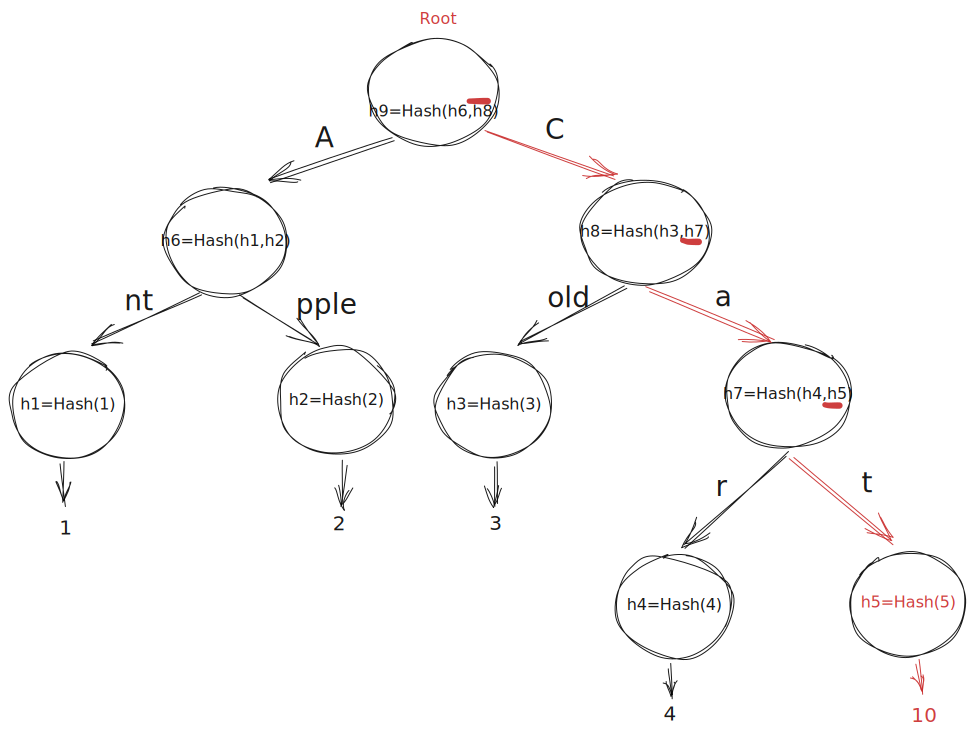

Figure 6 - A visual representation of the changes propagating to the root node

Note that it also makes sense to store lists in Merkle Patricia trees. The only difference with the above is that the value would be the position in the list. Consider the following list

```python
my_list = ["Ant", "Apple", "Cold", "Car", "Cat"]
```

We can convert the list to a map where each value points to its position (note that we consider the first index to be 1 - conveniently arriving at the same mapping that figure 5 shows) 

```python
my_list_mapping = {"Ant": 1, "Apple": 2, "Cold": 3, "Car": 4, "Cat": 5}
```

Hence, if two nodes agree on the root hash of an encoded list, they can be confident that not only does the other party have all the elements they do, but in the same order. 

Let’s talk specifics when it comes to advantages:

1. If one represents the world state (a mapping between account addresses and account states) as a Merkle Patricia tree, then it is trivial to verify that all participating nodes agree on the current world state. They must only verify that they all agree on the root hash. (The similar tangent to this is that sending mappings between two parties is very efficient - a fixed size bit array (representing the root hash) is passed along for arbitrary size mappings - of course the disadvantage is that you cannot derive the underlying mapping yourself).
2. Alice wants to verify that a transaction T has indeed been included in a block. (The block header contains the root hash of a Merkle Patricia tree encoding the list of transactions present in the block - $H^t$). For her to verify the transaction’s inclusion in the block, she does not need to fetch all of the transactions and compute the root hash - she must only fetch $log(N)$ transactions and work her way up the tree to verify. Visually:
    
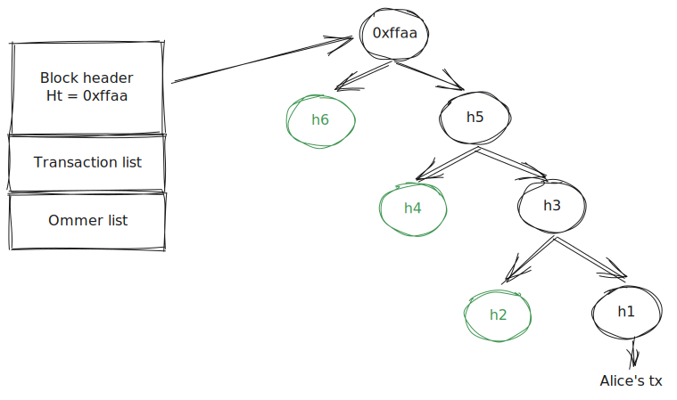    
    Figure 7
    

Alice wants to verify her transaction - whose hash is h1 (she knows this hash) - has been included in the given block (she also knows the transaction root, $H^t$, included in the block header). She will need to fetch h2, h4, and h6 from a node (these hashes are also called the Merkle Proof Path). Then, she can work out what h3, h5 and finally, the root node should be by hashing her way up the tree - if her computed root hash equals the block root hash then her transaction is part of the block. Hence, Alice is able to verify the inclusion of her transaction in the block by only needing to fetch $log(N)$  hashes (where $N$ is the total number of transactions). This is much better than needing to fetch all the transactions in the block. **Note -** She must fetch h6, h4, and h2 from a trusted source (a light node). If Alice trusts no one, she will need to replay the entire history of the blockchain to derive what h6, h4, and h2 are. (This will mean Alice will have to run a full node herself).

** [Here](https://bitcoin.stackexchange.com/questions/50674/why-is-the-full-merkle-path-needed-to-verify-a-transaction/50680#50680) is another brilliant visualisation of verifying transaction inclusion 

The only way to compute the current world state (in a trustless manner) is to follow all transactions from the genesis block to the tip of the blockchain. Nodes/miners store the world state (which is only a mapping as discussed earlier) in a **local database.** When new transactions arrive nodes and miners can confirm the validity by checking their local database. Upon confirmation, the local database will be updated to reflect the new world state.

---

The paper formally defines what the account state $\boldsymbol{\sigma}[a]$ contains

- Nonce

> A scalar value equal to the number of transactions sent from this address or, in the case of accounts with associated code, the number of contract-creations made by this account. For account of address $a$ in state $\boldsymbol{\sigma}$, this would be formally denoted $\boldsymbol{\sigma}[a]_n$
> 

Simply put, the number of transactions an account has issued. (Transactions can send value from one account to the other, they can interact with smart-contracts, and/or they can create contracts). 

Smart contracts (accounts with associated code in the words of the paper) have a nonce equal to the number of contracts deployed. If a *human* account sends a transaction to a smart-contract that interacts with another smart-contract, the nonce of the smart-contract account is kept the same. Only contract-creating transactions increment the nonce of contract accounts. (Contracts only interact with other contracts through message-calls; these message-calls do not change the nonce). 

 

- Balance

> A scalar value equal to the number of Wei owned by this address. Formally denoted $\boldsymbol{\sigma}[a]_b$
> 

- Storage Root

> A 256-bit hash of the root node of a Merkle Patricia tree that encodes the storage contents of the account (a mapping between 256-bit integer values), encoded into the trie as a mapping from the Keccak 256-bit hash of the 256-bit integer keys to the RLP-encoded 256-bit integer values. The hash is formally denoted $\boldsymbol{\sigma}[a]_s$
> 

The storage root is only relevant for contract accounts. *Human* accounts have as the default value the hash of the empty trie for the storage root. Contract account creation will be discussed in Section 7, but it is important to understand that contracts can have persistent storage. The persistent storage model is represented by an array where each element is 256 bits - note that the array size is not defined (users can store as much persistent contents as they choose - only restrained by the associated gas costs - will be discussed later). Visually the persistent storage model looks as follows


Figure 8 - The persistent storage model is a mapping between an index and a value. 

Values are packed together, and the next value that’d not fit into the previous block, will start a new block. For example  

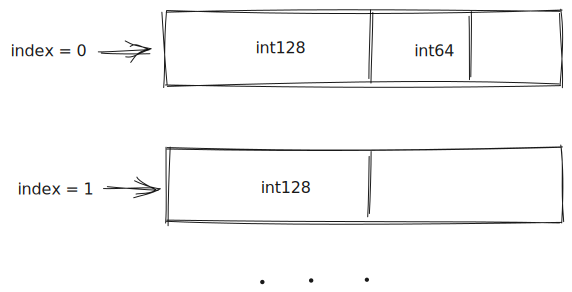

Figure 9

The storage root $\boldsymbol{\sigma}[a]_s$ represents the following mapping 

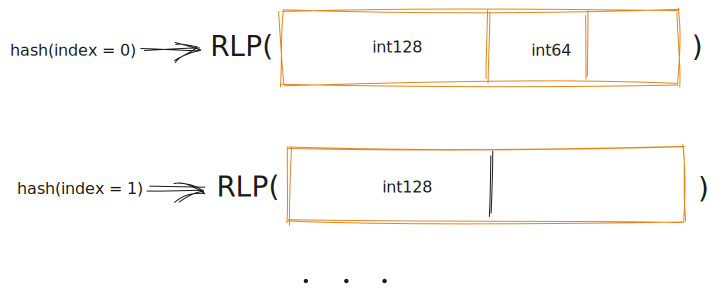

Figure 10

The key is the hash of the index and the value is the RLP encoding of the byte sequence located at the memory location corresponding to the key. (At index 0, we’d pass the int128 bit array concatenated with the int64 bit array padded with 0’s to make the 256 bit array or 32 byte array value at memory location 0).  

RLP takes as input a byte array and spits out a byte array. RLP has been developed specifically for Ethereum. The reason for its use is that its implementation is simple and consistent. These two qualities arise from the fact that its input is always treated as a byte array regardless of what that byte array might mean. For example, if a list of numbers has the same byte representation as a list of booleans, then the output will be the same. This is not usually the case with other encoding as the types of the inputs are usually taken into consideration.

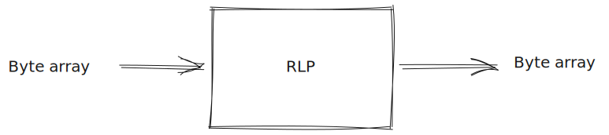

Figure 11

- Code Hash

> The hash of the Ethereum Virtual Machine (EVM) code of this account—this is the code that gets executed should this address receive a message call. All such code fragments are contained in the state database under their corresponding hashes for later retrieval. This hash is formally denoted $\boldsymbol{\sigma}[a]_c$, and thus the code may be denoted as $b$, given that $KEC(b) = \boldsymbol{\sigma}[a]_c$
> 

*Human* accounts do not have any code, and hence they store the hash of the empty byte array as their code hash. Smart-contracts have the code that runs every time an interaction occurs as their code hash. Note that the hashing function used is the [Keccak256](https://ethereum.stackexchange.com/questions/11572/how-does-the-keccak256-hash-function-work) hashing function. Note also the subtlety the paper mentions. “All such code fragments are contained in the state database under their corresponding hashes for later retrieval”. We mentioned earlier that the world state is stored in a local database. We know that an account (which is part of the world state) contains a code hash $\boldsymbol{\sigma}[a]_c$. As the name mentions, the code hash $\boldsymbol{\sigma}[a]_c$ is only the hash of a fragment of code. For that code to be callable, the local database must store a reference to it (in its non-encoded representation). The local database will contain a key-value mapping between code hashes and the code fragments to be executed. This is a common trend in the implementation of the Ethereum protocol. When a piece of data is hashed, its value must be stored in the local database for later retrieval. We only hash to reduce the memory footprint of the data that we communicate with. (It is more efficient for us to pass the hash of the code fragment than the code fragment itself - however, we rely the recipient has a local database entry for the code hash that we send) ([Geth](https://geth.ethereum.org/) - the ethereum protocol implementation written in go, uses the [leveldb](https://github.com/google/leveldb) key-value storage as the database). 

A brilliant visualisation of the world state and the backend databases required is given in figure 12. 

](figures/world_state.png)

Figure 12 - A visualisation of the world state and the associated backend databases needed to hold the world state. Adapted from Ethereum EVM illustrated by Takenobu T. See [here](https://takenobu-hs.github.io/downloads/ethereum_evm_illustrated.pdf)

The state consists of many accounts. The mapping between the 160 bit address identifiers (also known as the public key) to the account state is held in a database for every running node. The storage hash and code hash (not relevant for non-contract accounts) are hashes which themselves represent keys in another set of key-value storage means. The values represent the storage of the account and the code respectively.

---

Section 4.1 concludes with some definitions and mathematical notations that will help explain trickier concepts later down the paper. Let’s examine them:

(7)    $TRIE(L_I^{\star}(\boldsymbol{\sigma}[a]_s)) \equiv \boldsymbol{\sigma[a]_s}$

To understand equation 7, we must understand equation 8, as $L_I^\star$ is (as per the conventions in section 4), is the *array-version* function of $L_I$ - introduced by equation 8

(8)  $L_I((k,v)) \equiv (KEC(k), RLP(v))$

What equation 8 tells us is that $L_I$ takes as input a tuple and returns a tuple - with the first element of the returned tuple being the KEC of the first element of the input tuple, and the second element from the returned tuple being the RLP of the second element of the input tuple. We can deduce that $L_I^\star$ must hence take an array of such tuples and return an array of such transformed tuples. Let’s dig deeper into equation 8. We know that $\boldsymbol{\sigma}[a]_s$ is the storage root (the hash of the Merkle Patricia Tree  containing the mapping between the position and value of the persistent memory model). So how can we have as input a hash when we know we expect a list of tuples? This is where convention is bent a little bit. What we mean when we say $L_I^\star(\boldsymbol{\sigma}[a]_s)$ is actually to feed the mapping represented by the storage root $\boldsymbol{\sigma}[a]_s$ as a list of tuples into the $L_I^\star$ function. So if the storage root was to represent the following underlying mapping

```python
storage = {0: 12, 1: 13, 2: 100}
```

Then we’d actually be feeding 

```python
storage = [(0,12),(1,13),(2,100)]
```

Into $L_I^\star$. Hence $L_I^\star(\boldsymbol{\sigma}[a]_s)$ becomes 

```python
[(KEC(0), RLP(12)),(KEC(1), RLP(13)),(KEC(2), RLP(100)]
```

Finally, we feed this into $TRIE$ which takes as input such a list and returns the hash of the root of the Merkle Patricia Tree that represents this mapping. In other words, $TRIE$ will output the root hash of the patricia tree encoding the following mapping

```python
{
	KEC(0): RLP(12),
	KEC(1): RLP(13),
	KEC(2): RLP(100
}
```

> If the codeHash field is the Keccak-256 hash of the empty string, i.e. $\boldsymbol{\sigma}[a]_c = KEC(())$, then the node represents a simple account, sometimes referred to as a “non-contract” account … we may define a **world-state collapse function** $L_S$:
> 

(10)  $L_S(\boldsymbol{\sigma}) \equiv \{p(a) : \boldsymbol{\sigma}[a] \neq \emptyset \}$

Again, to understand equation 10, we must understand equation 11

(11)  $p(a) \equiv (KEC(a), RLP((\boldsymbol{\sigma}[a]_n, \boldsymbol{\sigma}[a]_b, \boldsymbol{\sigma}[a]_s, \boldsymbol{\sigma}[a]_c)))$

So $L_S(\boldsymbol{\sigma})$ maps every account such that $\boldsymbol{\sigma}[a] \neq \emptyset$ to the tuple whose first element is the KEC of the address, and the second element is the RLP of the tuple that makes up the account. (I mentioned earlier that RLP only accepts bytes - consider $(\boldsymbol{\sigma}[a]_n, \boldsymbol{\sigma}[a]_b, \boldsymbol{\sigma}[a]_s, \boldsymbol{\sigma}[a]_c)$ as the byte concatenation of the byte representation of $\boldsymbol{\sigma}[a]_n$ … $\boldsymbol{\sigma}[a]_c$). The question remains: For what accounts does the condition $\boldsymbol{\sigma}[a] \neq \emptyset$ hold ? Equation 12 helps us understand that exact question

(12)   
$\forall a: \boldsymbol{\sigma}[a] = \emptyset \space \lor (a \in \mathbb{B}_{20} \space \land v(\boldsymbol{\sigma}[a]))$

Equation 12 tells us that $\boldsymbol{\sigma}[a] = \emptyset$ if the condition $(a \in \mathbb{B}_{20} \space \land v(\boldsymbol{\sigma}[a]))$ does NOT hold. So if $a$ :

1. Is not a 20 byte array $a \in \mathbb{B}_{20}$ **OR**
2. Is not valid $v(\boldsymbol{\sigma}[a])$

**Then** $\boldsymbol{\sigma}[a] = \emptyset$

The next question to ask is: What does it mean for an account to be valid? Equation 13 helps us understand this exact question

(13)  $`v(x) \equiv x_n \in \mathbb{N}_256 \land x_b \in \mathbb{N}_{256} \land x_s \in \mathbb{B}_{32} \land x_c \in \mathbb{B}_{32}`$

We know $\boldsymbol{\sigma}[a]$ returns the tuple representing the account (note that the account tuple still contains the storage root - even though when we serialise the account tuple we omit it). Hence we feed the account tuple to $v(x)$. This function returns a boolean that is true when 

1. The nonce is a positive integer less than $2^{256}$
2. The balance is a positive integer less than $2^{256}$
3. The storage root is a byte array of 32 bytes exactly
4. The code hash is a byte array of 32 bytes exactly

Hence the validity function is quite dumb in that the only thing it checks is that the format is correct. 

> An account is empty when it has no code, zero nonce and zero balance
> 

(14)  $EMPTY(\boldsymbol{\sigma}, a) \equiv \boldsymbol{\sigma}[a]_c = KEC(()) \space \land \boldsymbol{\sigma}[a]_n = 0 \space \land \boldsymbol{\sigma}[a]_b = 0$

> Even callable precompiled contracts can have an empty account state. This is because their account states do not usually contain the code describing its behavior
> 

I’ll refer to [here](https://ethereum.stackexchange.com/questions/94364/how-can-callable-contracts-have-an-empty-account-state) for an excellent explanation of the above statement. In words, precompiled contracts are contracts that exist virtually. They have not been deployed like other normal contracts, but when calls are made to them, the implementation understands what to do. As such, because they have not been deployed the address associated with them is an $EMPTY$ address

> An account is dead when its account state is non-existent or empty
> 

(15)  $DEAD(\boldsymbol{\sigma},a) \equiv \boldsymbol{\sigma}[a] = \emptyset \space \lor EMPTY(\boldsymbol{\sigma}, a)$

As of [EIP-161](https://eips.ethereum.org/EIPS/eip-161), no transaction will finalise with $EMPTY$ accounts in the returned state. If there exist $EMPTY$ accounts at the end of a transaction, they are deleted $\boldsymbol{\sigma}[a] = \emptyset$. This was not always the case. Pre [EIP-158](https://eips.ethereum.org/EIPS/eip-158) (161 being an iteration on 158 that solved some edge cases that 158 did not take into account) $EMPTY$ accounts could be created by an account sending $WEI$ to accounts that did not exist. One could also create $EMPTY$ accounts by calling `SUICIDE` with the beneficiary of the `SUICIDE` being an account that was not in existence. At the end of such transactions, the state contained an account that was $EMPTY$. A [malicious actor](https://blog.ethereum.org/2016/11/25/security-alert-11242016-consensus-bug-geth-v1-4-19-v1-5-2) used this vulnerability to inflate the state with a large quantity of $EMPTY$ accounts - rapidly spiking the memory requirements of running a full node - a variation of DoS attack. To prevent this from happening, EIP-161 prevents transactions from finalising with $EMPTY$  accounts - any $EMPTY$ accounts are deleted.  Note that $EMPTY$ accounts can **still exist temporarily**. See [here](https://www.notion.so/The-annotated-Ethereum-yellow-paper-af227a53325c478da74086edb4fc75bb?pvs=21) for an example

Note the slight caveat here. $EMPTY$ and $DEAD$ are defined for a certain world state $\boldsymbol{\sigma}$. The best way to understand this is to remember that multiple forks may exist in the protocol. Hence one fork might have one world state $\boldsymbol{\sigma}_1$, but another fork may have another world state $\boldsymbol{\sigma}_2$. So, $a$ may be $DEAD$ in $\boldsymbol{\sigma}_1$ but may not be $DEAD$ in $\boldsymbol{\sigma}_2$. 

## Section 4.2 - The Transaction

> A transaction (formally, T ) is a single cryptographically-signed instruction constructed by an actor externally to the scope of Ethereum. The sender of a transaction cannot be a contract. While it is assumed that the ultimate external actor will be human in nature, software tools will be used in its construction and dissemination. EIP-2718 by Zoltu [2020] introduced the notion of different transaction types. As of the Berlin version of the protocol, there are two transaction types: 0 (legacy) and 1 (EIP-2930 by Buterin and Swende [2020b]). Further, there are two subtypes of transactions: those which result in message calls and those which result in the creation of new accounts with associated code (known informally as ‘contract creation’)
> 

Although EIP-2718 introduced the concept of different transaction types, only 2 exist at the moment of writing. There is the legacy transaction of type 0, and the EIP-2930 type 1 transaction. 

The transaction tuple $T$ contains the following fields

- Type - $T_x \in \{0, 1\}$
- Nonce - $T_n$ equal to the sender’s nonce - $T_n \in \mathbb{N}_{256}$
- Gas Price - $T_p$ - amount paid in $Wei$ per unit of gas - $T_p \in \mathbb{N}_{256}$
- Gas Limit - $T_g$ - maximum amount of gas to be used by tx - Remember that Ethereum is Turing complete (we cannot know when execution will stop / or if it will stop). The maximum gas price in $Wei$ will hence be $gas * T_p$ and $gas \leq T_g$ - $T_g \in \mathbb{N}_{256}$
- To - $T_t$ - note that $T_t = \emptyset$ if the transaction is a contract-creating transaction - $T_t \in \mathbb{B}_{20}$  if $T_t \neq \emptyset$, otherwise, $T_t \in \mathbb{B}_0$
- Value - $T_v$ - note that in the case of a contract-creating transaction, the contract will contain this value of $Wei$ after (and only if) it has been initated - $T_v \in \mathbb{N}_{256}$
- r, s - $T_r , T_s$ - Used to verify the transaction has been signed correctly -  $T_r \in \mathbb{N}_{256} \space \land T_s \in \mathbb{N}_{256}$

> [EIP-2930](https://eips.ethereum.org/EIPS/eip-2930) (type 1) transactions also have
> 
- Access List -$T_A$  - a list of elements of form $E \equiv (E_a, E_s)$ - Accounts $E_a$ and storage key**s** $E_s$ that are part of this list at the beginning of the transaction will allow execution of certain opcodes to execute at a discount. (This is because clients can load the addresses and storage keys before, as opposed to cold fetching them during execution - this is a very heavy IO operation). To understand this better, consider Figure 9. A storage key is nothing more than the index at which a variable resides. If I wanted to efficiently access the int64 from storage key 0, I’d provide in the access list as $E_a$ the address of the contract in question, and for $E_s$ the list of size 1 containing the single storage key 0 (encoded as a 32 byte value). I can do this operation to produce a list of $E \equiv (E_a, E_s)$ for all the contracts I want to access and all the storage keys that I want to access per contract. Here is the type annotation for the access list:

```python
access_list: list[tuple[Address, list[Bytes32]]]
```

- Chain Id - $T_c$
- y Parity - $T_y \in \mathbb{N}_1$

> Legacy transactions do not have an accessList ($T_A$ = ()), while chainId and yParity for legacy transactions are combined into a single value:
> 
- w - $T_w \in \mathbb{N}_{256}$

> Additionally, a contract creation transaction (regardless whether legacy or EIP-2930) contains:
> 
- init - $T_i$ - EVM-code that gets executed once (during contract creation). $T_i$  gets discarded after the contract has been created - but $T_i$ should return another fragment of EVM-code that gets executed every time the contract receives a transaction. In other words, $T_i$ is the constructor code responsible for returning all the code that correctly routes function calls to the appropiate code - $T_i \in \mathbb{B}$

> In contrast, a message call transaction contains:
> 
- data - $T_d$ - unlimited size byte array specifying the input data - $T_d \in \mathbb{B}$

## Section 4.3 - The Block

> The block in Ethereum is the collection of relevant pieces of information (known as the block header), $H$, together with information corresponding to the comprised transactions, $T$, and a set of other block headers $U$ that are known to have a parent equal to the present block’s parent’s parent (such blocks are known as ommers).
> 

Mathematically, we describe the block as 

(21) $B \equiv (B_H, B_T, B_U)$

Visually, we have

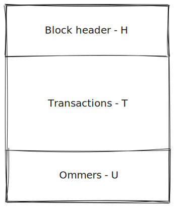

Figure 13 - Note that ommer is just a gender-neutral term. The set of qualifying blocks can also be referred to as uncles

In terms of the ommer blocks, there is no better explanation than a diagram

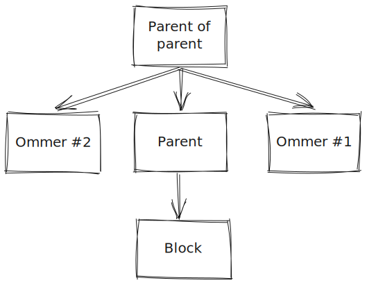

Figure 14 - A diagram explaining the relationship between a block and its ommer list

Note that not all blocks that satisfy this condition must be set in the ommer list. The block creator is incentivised to include at most 2 such block headers as each such block header rewards the miner.  The decision to include block headers that satisfy this condition has been made to compensate miners that end up mining at the same time. (This is a more common occurrence in Ethereum due to the shorter block time. Note that including ommer blocks also has the added benefit that up to 3 worth of work done can be included at the same level (1 main block and 2 ommers)).

---

The block header contains the following fields:

- Parent Hash - $H_p$
    
    > The Keccak 256-bit hash of the parent block’s header, in its entirety
    > 
    
    A block header is nothing more than a tuple whose keys are described in this section (One can obtain the $KEC$ of a tuple). Every block contains the $H_p$ to correctly identify a block’s parent.  
    
- Ommers Hash - $H_o$
    
    > The Keccak 256-bit hash of the ommers list portion of this block
    > 
    
    As mentioned before, miners are incentivised to include ommer blocks in their block as they receive rewards for doing so. One can obtain the $RLP$ of a list, and $H_o$ is the $KEC$ of the $RLP$ of the list of ommer block headers.
    
- Beneficiary - $H_c$
    
    > The 160-bit address to which all fees collected from the successful mining of this block be transferred
    > 
    
    This is the miner of the block - It might be that the miner is not the beneficiary if the miner is part of a pool. In this case, the beneficiary would be the master wallet of the pool.
    
- State Root - $H_r$
    
    > The Keccak 256-bit hash of the root node of the state trie, after all transactions are
    > 
    > 
    > executed and finalisations applied
    > 
    
    Remember that $\boldsymbol{\sigma}$ represents the world state. This is equivalent to saying that $\boldsymbol{\sigma}$ is the state at the end of the last block (after all the transactions in the last block have been executed). $\boldsymbol{\sigma}$ is the $H_r$ of the current last block
    
- Transactions Root - $H_t$
    
    > The Keccak 256-bit hash of the root node of the trie structure populated with each
    > 
    > 
    > transaction in the transactions list portion of the block
    > 
    
    Remember that we can construct tries from lists by considering the key to be the position in the list.
    
- Receipts Root - $H_e$
    
    > The Keccak 256-bit hash of the root node of the trie structure populated with the receipts of each transaction in the transactions list portion of the block
    > 
    
    We will talk about receipts in more detail in section 4.3.1. For now, it suffices to say that every transaction will generate a transaction receipt - this contains useful information about the state changes and the events a transaction has generated. 
    
- Logs Bloom - $H_b$
    
    > The Bloom filter composed from indexable information (logger address and log topics) contained in each log entry from the receipt of each transaction in the transactions list
    > 
    
    We will discuss bloom filters at length in section 4.3.1. For now, it suffices to say that $H_b$ is present in the block header to allow client applications to easily search for events (across the entire history of the blockchain). Remember how events look like in solidity
    
    ```solidity
    event Transfer(address from, address to, uint256 value)
    ```
    
- Difficulty - $H_d$
    
    > A scalar value corresponding to the difficulty level of this block. This can be calculated from the previous block’s difficulty level and the timestamp
    > 
    
    The Proof-of-Work scheme incorporated into the blockchain can be summarised as trying to find a value that when combined with the contents of the block will be hashed to a value less than a certain other value. The smaller the value you want to find the hash to be less than, the more work you need to put in. $H_d$ is a formal way to define the value you need the hash to be less than. A more formal explanation will be given in section 4.3.4.
    
- Number - $H_i$
    
    > A scalar value equal to the number of ancestor blocks. The genesis block has a number of zero
    > 
- Gas Limit - $H_l$
    
    > A scalar value equal to the current limit of gas expenditure per block
    > 
- Gas Used - $H_g$
    
    > A scalar value equal to the total gas used in transactions in this block
    > 
- Timestamp - $H_s$
    
    > A scalar value equal to the reasonable output of Unix’s time() at this block’s inception
    > 
- Extra Data - $H_x$
    
    > An arbitrary byte array containing data relevant to this block. This must be 32 bytes or fewer
    > 
    
    This can be anything that the miner wishes to put on the blockchain. Some mining pools use this field to log their blocks.
    
- Mix Hash - $H_m$
    
    > A 256-bit hash which, combined with the nonce, proves that a sufficient amount of computation has been carried out on this block
    > 
- Nonce - $H_n$
    
    > A 65-bit value which, combined with the mix-hash, proves that a sufficient amount of computation has been carried out on this block.
    > 

See [here](https://ethereum.stackexchange.com/questions/5833/why-do-we-need-both-nonce-and-mixhash-values-in-a-block) for why we need both the $H_n$ and the $H_m$. We will not go into too much detail about PoW related concepts as The Merge has already occurred at the time of writing. 

### **Section 4.3.1 Transaction Receipt**

> In order to encode information about a transaction concerning which it may be useful to form a zero-knowledge proof, or index and search, we encode a receipt of each transaction containing certain information from its execution. Each receipt, denoted $B_R[i]$ for the $i$th transaction, is placed in an index-keyed trie and the root recorded in the headers as $H_e$.
> 

Each transaction receipt is a tuple as follows

(22)  $R \equiv (R_x, R_z, R_u, R_b, R_l)$

- $R_x$  - the type of transaction - See $T_x$
- $R_z$ - the status code of the transaction - $R_z \in \mathbb{N}$
- $R_u$ - the cumulative gas used
    
    So if the transaction with index 0 uses 50 gas, and the transaction with index 1 uses 100 gas, then $B_R[0]_u$ = 50 and $B_R[1]_u = 50 + 100 = 150$ 
    
- $R_b$ - logs bloom - $R_b \in \mathbb{B}_{256}$ - see below
- $R_l$ - series of log entries $(O_0, O_1, ...)$ where a log entry is of the form:
    
    (26)  $O \equiv (O_a, (O_{t_0}, O_{t_1}, ...), O_d)$
    
    With
    
    (27)  $`O_a \in \mathbb{B}_{20} \space \land \forall x\in O_{\boldsymbol{t}} : x \in \mathbb{B}_{32} \space \land O_d \in \mathbb{B}`$
    
    From equation 27 we deduce that:
    
    - $O_a$ - logger address - is a 20 byte array - This corresponds to what we already know: *Human* addresses and contract addresses have, as their public address - a 20 byte array. Note that only contracts produce logs as part of an execution of a transaction sent to said contract. $O_a$ is the **contract’s public address that produced the log**
    - $O_{\boldsymbol{t}}$ - series of log topics - a list (possibly empty) of 32 byte log topics
    - $O_d$ - un-indexable data - is an arbitrary size byte array

In code we can represent it as follows

```python
@dataclass
class Receipt:
    """
    Result of a transaction.
    """

    succeeded: Uint
    cumulative_gas_used: Uint
    bloom: Bloom
    logs: list[Log]

@dataclass
class Log:
    """
    Data record produced during the execution of a transaction.
    """

    address: Address
    topics: list[Hash32]
    data: bytes

Bloom = Bytes256
```

So what are the log topics $O_{\boldsymbol{t}}$ and the un-indexable data $O_d$ ? Let’s work through an example to understand this. Consider the following event

 

```solidity
event CustomEvent(address from, address to, uint256 val, bool flag, uint256 extra)
```

And consider that we emit it as follows

```solidity
emit CustomEvent(
	0x1dD2C14FE654653AA64575cDb8073e96C9E8e1AC,
	0xA4FaB302791C00B21884880446a7Ea4B8Bb570ca,
	123456789,
	true,
	11
)
```

The first topic $O_t[0]$ in the series $O_t$ is the $KEC$ of the canonical signature of the event being emitted. The canonical signature of the event above is as follows

```solidity
CustomEvent(address, address, uint256, bool, uint256)

```

The $KEC$ of the above (use [this](https://emn178.github.io/online-tools/keccak_256.html)) is: 

`ee40736e546f59e06859e69a8f70c89ca4efe416415e84b7df851d188d791e64`

The next  log topic $O_t[1]$ is the 0-padded (to 32 bytes) value of the first argument of the event. For our example, that’d correspond to

`0x0000000000000000000000001dD2C14FE654653AA64575cDb8073e96C9E8e1AC`

We continue like this until we have generated a list of log topics $O_{\boldsymbol{t}}$ that has a length of at most 4 (corresponding to the `LOG1` - `LOG4` set of instructions - see appendix H)(note that we convert the value of `uint256` and of the `bool` into their hex equivalent. 

```json
{
  "address": "0xbb9bc244d798123fde783fcc1c72d3bb8c189413",
  "topics": [
    "0xee40736e546f59e06859e69a8f70c89ca4efe416415e84b7df851d188d791e64",
    "0x0000000000000000000000001dD2C14FE654653AA64575cDb8073e96C9E8e1AC",
    "0x000000000000000000000000A4FaB302791C00B21884880446a7Ea4B8Bb570ca",
		"0x00000000000000000000000000000000000000000000000000000000075BCD15",
		"0x0000000000000000000000000000000000000000000000000000000000000001",
  ]
}
```

So what happens to the final argument `uint256 extra` ? All arguments that do not fit end up being concatenated into the $O_d$ byte array (they are zero padded to 32 bytes). In our example $O_d$ would simply be `0x000000000000000000000000000000000000000000000000000000000000000B` . If we had an additional argument whose hex value would be `A` then $O_d$ would look like `0x000000000000000000000000000000000000000000000000000000000000000B000000000000000000000000000000000000000000000000000000000000000A`  (we zero pad all arguments before concatenating). We can then represent the whole log entry as follows

```json
{
  "address": "0xbb9bc244d798123fde783fcc1c72d3bb8c189413",
  "topics": [
    "0xee40736e546f59e06859e69a8f70c89ca4efe416415e84b7df851d188d791e64",
    "0x0000000000000000000000001dD2C14FE654653AA64575cDb8073e96C9E8e1AC",
    "0x000000000000000000000000A4FaB302791C00B21884880446a7Ea4B8Bb570ca",
		"0x00000000000000000000000000000000000000000000000000000000075BCD15",
		"0x0000000000000000000000000000000000000000000000000000000000000001",
  ],
	"data": "0x000000000000000000000000000000000000000000000000000000000000000B"
}
```

**Please note** that the description above corresponds to 1 implementation of the solidity compiler. The yellow paper makes no note of what happens to solidity code. The yellow paper only clearly defines what happens for the `LOG0`,`LOG1`, `LOG2`, `LOG3` ,and `LOG4` opcodes (defined in the appendix. Hence, the solidity compiler makes use of the opcodes defined in the appendix to achieve the behaviour described above. The fact that the highest *value* opcode is `LOG4` is the reason behind only being able to generate 4 log topics. 

With the log entry clearly defined and explained by example, we proceed to take a log entry and reduce it to a single 256-byte hash. 

(28)  $M(O) \equiv \bigvee_{x \in \{O_a\} \cup O_{\boldsymbol{t}}}(M_{3:2048}(x))$

Equation 28 states that we concatenate the value of the logger’s address $O_a$ with all the log topics (which themselves are an array of bytes - see above) and feed that concatenation into the $M_{3:2048}$ function. The paper states that the specialised Bloom filter function $M_{3:2048}$ does indeed take as input an arbitrary sized array and produces a 256 byte hash. In our example we feed a $32 * 4 + 20 = 148$  (4 log topics and a single 20 byte contract address) byte array. Let’s proceed by working through the example (to understand how the specialised bloom filter function works) before we address its motivation. The byte array that we’ll be feeding in is as follows: 

`0xbb9bc244d798123fde783fcc1c72d3bb8c189413` concatenate with `0xee40736e546f59e06859e69a8f70c89ca4efe416415e84b7df851d188d791e64` concatenate with `0x0000000000000000000000001dD2C14FE654653AA64575cDb8073e96C9E8e1AC` concatenate with `0x000000000000000000000000A4FaB302791C00B21884880446a7Ea4B8Bb570ca` concatenate with `0x00000000000000000000000000000000000000000000000000000000075BCD15` concatenate with `0x0000000000000000000000000000000000000000000000000000000000000001`

This corresponds with

`0xbb9bc244d798123fde783fcc1c72d3bb8c189413ee40736e546f59e06859e69a8f70c89ca4efe416415e84b7df851d188d791e640000000000000000000000001dD2C14FE654653AA64575cDb8073e96C9E8e1AC000000000000000000000000A4FaB302791C00B21884880446a7Ea4B8Bb570ca00000000000000000000000000000000000000000000000000000000075BCD150000000000000000000000000000000000000000000000000000000000000001`

This is the $x$ in equation 29

(29)  $M_{3:2048}(\boldsymbol{x} : \boldsymbol{x}\in \mathbb{B}) \equiv \boldsymbol{y} : \boldsymbol{y} \in \mathbb{B}_{256}$  where

(30)  $\boldsymbol{y} = (0,0, ..., 0)$  except

(31)  $\forall i \in \{0,2,4\} : \mathcal{B}_{2047 - m(\boldsymbol{x},i)}(\boldsymbol{y}) = 1$

(32)  $m(\boldsymbol{x}, i) \equiv KEC(\boldsymbol{x})[i, i+1] \space mod \space 2048$

Following through to equation 30, the result of applying $M_{3:2048}$ to $x$ is a 256 byte array with all the entries being 0 - exception being 3 **bits**. The bits in the 256-byte array $y$ that are set to 1 have index:

 ****

- 2047 - $m(x,0)$
- 2047 - $m(x,2)$
- 2047 - $m(x,4)$

The $KEC$ of $x$ is given by `e0b060be26a18398d0191f7969c0c819b29fe76fc73fbbed242d413ec70cf7c1` 

To obtain this install the `Web3` package `pip3 install Web3` and run the following

```python
>>> from Web3 import web3
>>> x = Web3.toBytes(0xbb9bc244d798123fde783fcc1c72d3bb8c189413ee40736e546f59e06859e69a8f70c89ca4efe416415e84b7df851d188d791e640000000000000000000000001dD2C14FE654653AA64575cDb8073e96C9E8e1AC000000000000000000000000A4FaB302791C00B21884880446a7Ea4B8Bb570ca00000000000000000000000000000000000000000000000000000000075BCD150000000000000000000000000000000000000000000000000000000000000001)
>>> kec = Web3.keccak(x)
>>> kec
HexBytes('0xe0b060be26a18398d0191f7969c0c819b29fe76fc73fbbed242d413ec70cf7c1')
```

Remember that python slicing is non-inclusive to the end - We need to do `[i:i+2]` to replicate the $KEC(\boldsymbol{x})[i,i+1]$

```python
>>> kec[0:1]
HexBytes('0xe0') 
>>> kec[0:2]
HexBytes('0xe0b0')
```

Hence:

```python
>>> Web3.toInt(kec[0:2]) % 2048
176
>>> Web3.toInt(kec[2:4]) % 2048
190
>>> Web3.toInt(kec[4:6]) % 2048
1697
```

So

- 2047 - 176 = 1871
- 2047 - 190 = 1857
- 2047 - 1697 = 350

This means that $y$ is a 256 **byte** array where the **bits** with index 350, 1857, and 1871 are set to 1. (**Note** that the indices are in big-endian formatting - more significant bits will have smaller indices). 

---

So what was the use of all that? We still need to explain bloom filters

[Bloom filters](http://www.eecs.harvard.edu/~michaelm/postscripts/im2005b.pdf) are a specialised data structure that allows the representation of a set of values for the purpose of membership queries.  A bloom filter data structure is nothing more than a series of bits (the length does not need to be equal to the length of the set that it encodes). The series starts off by having all the bits set to 0. Through an iterative process, every single element in the underlying set is passed through a function that outputs a number of bit indices that should be turned to 1. For example, consider the following set of bits 

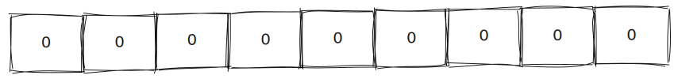

Figure 15 - Initial state of the bits when constructing a blooms filter

Consider that we want to represent the following set `[1, 2, 5]`

Consider that the function that outputs the indices for each element looks like this

```python
def f(elem: int) -> tuple[int,int, int]:
  return (elem + 1, elem + 2, elem + 3)
```

This means

```python
>>> f(1)
(2,3,4)
>>> f(2)
(3,4,5)
>>> f(5)
(6,7,8)
```

Setting the bits to 1 for all the indices returned results in the following

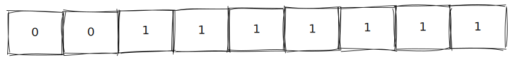

Figure 16 - Bloom filter representation after setting all bit indices associated with the set stored to 1

Now for the membership queries: A bloom filter will return `true` for the inclusion of an element if the indices associated with a certain element are set to true. However, this may result in false positives. Consider

```python
>>> f(4)
(5,6,7)

```

Note that indices 5, 6, and 7 are already set to 1 from the elements 2 and 5. Hence, bloom filters provide a way to test for inclusion of certain elements with a certain probability of false positives (dictated by the function of choice and number of bits in the initial set). The advantages come when a certain degree of *wrong* outweighs the major drawback of storing a data structure with 100% correctness.  The exercise presented above - where we turned a log entry $O$ into a series of bits (of which only 3 are set to true) - is how Ethereum uses the concept of bloom filters for efficient membership queries of events. $M_{3:2048}$ is a slightly more sophisticated version of the function `f`. By turning all log entries into a series of tuples of 3 indices, Ethereum creates a bit series (of size 2048 due to the mod we take) where each log entry sets exactly 3 of those bits to 1 - this is $H_b$. When a client comes to a node and asks for all events of a certain signature, the node will look through all blocks and check if the 3 bit indices associated with the log entry requested are 1 in the $H_b$ of the block. Although there will be some false positives, this saves a lot of space as nodes do not need to hold all logs in a separate table. The client can then replay all the transactions of all the blocks returned and generate all the logs of the block. The client can then eliminate all the false positive and obtain all the events of a certain signature. Note that one can only query events using the arguments that *fit* in the `LOG1`, `LOG2`, `LOG3`, and `LOG4` (as they are the ones used to compute which 3 bits are set to 1). That is why we refer to $O_d$ as un-indexable data.

---

Using [this](http://www.eecs.harvard.edu/~michaelm/postscripts/im2005b.pdf) paper as reference (specifically section 2.1), one can obtain an approximation for the probability of false positives. 

$(1-e^{\frac{-kn}{m}})^k$

We have 

- k = 3 - We only set 3 bits to 1 per element
- n = 70 - This is an assumption for the average number of tx per block
- m = 2048 - We $mod \space 2048$ hence we only set a maximum of 2048 bits to 1

Plugging all this in results in a false positive probability of $9.2564\mathrm{e}{-10}$

### **Section 4.3.2 Holistic Validity**

A block is valid if the following conditions (all part of equation 33) hold: 

(33)  $H_r \equiv TRIE(L_S(\Pi(\boldsymbol{\sigma},B)))$

The block header’s state root should be the hash of the root node of the state trie after all transactions have been executed **and** finalizations applied (rewarding the miner etc…)

(33)  $H_o \equiv KEC(RLP(L_H^\star(B_U)))$  

The block header’s ommer hash is the hash of the $RLP$ representation of the list made up of the ommer blocks’s header contents. To understand this, we need to consider equation 37 that takes a block header and returns a tuple with all its element:

(37)   $L_H(H) \equiv (H_p, H_o, H_c, H_r, H_t, H_e, H_b, H_d, H_i, H_l, H_g, H_s, H_x, H_m, H_n)$

Knowing the definition of $L_H$ we know - due to the conventions from section 3 - that $L_H^\star$ is the function that applies the same behaviour to a list. Hence, we feed the list of ommer block headers $B_U$ to $L_H^\star$. This produces a list where each element is a tuple containing all the elements of the block’s header. Finally, we take the $RLP$ of a list and feed the result into the $KEC$ function to obtain the hash of the $RLP$ encoding of the list containing the serialised ommer block headers. 

(33)  $H_t \equiv TRIE(\{\forall i < ||B_T||, i\in\mathbb{N}: p_T(i, B_T[i])\})$

The transactions root is the hash of the root node of the trie structure populated with the transactions contained in the block. To understand this equation, we must consult equation 34:

(34)  $`p_T(k,T) \equiv (RLP(k), \begin{cases}RLP(L_T(T))&\text{if } T_x=0\\ (T_x) \cdot RLP(L_T(T)) &\text{otherwise }\end{cases}`$

Equation 34 simply returns a tuple where the first element is the RLP encoding of its first argument and the second value in the tuple is either the RLP encoding of the tuple made from all the elements of the transaction (if the transaction type is 0), either the concatenation of the transaction type with the RLP encoding of the tuple made from all the elements of the transaction. Note that $L_T$ is given in equation 16

(16)  $`L_T(T) \equiv \begin{cases} (T_n, T_p, T_g, T_t, T_v, \boldsymbol{p}, T_w, T_r, T_s)&\text{if} &T_x=0 \\(T_c, T_n, T_p, T_g, T_t, T_v, \boldsymbol{p}, T_{\boldsymbol{A}}, T_y, T_r, T_s &\text{if} &T_x =1 \end{cases}`$

(33)   $H_e \equiv TRIE(\{\forall i < ||B_R||, i \in \mathbb{N}: p_R(i, B_R[i])\})$

The receipt root is similar to the transaction root, except we use the $L_R$ and $p_R$ which operate on receipts as opposed to $L_T$ and $p_T$ which operate on transactions.

(33) $H_b \equiv \bigvee_{r\in B_{\boldsymbol{R}}}(\boldsymbol{r}_b)$

The logs bloom of a block, as mentioned in section 4.3.1, is nothing nothing more than a series of 2048 bits. They are all initially set to 0 and each log entry spits 3 bit indices which turns the bits at those indices to 1 (if the bits are already 1 from another previous log entry, we do nothing). In mathematical terms, we use $\bigvee$ to denote the bitwise `or` between a set of elements. The set is given by $r \in B_{\boldsymbol{R}}$ (all the transaction receipts in the block). Moreover, for all the transaction receipts in the block, we bitwise `or` the logs bloom $\boldsymbol{r}_b$ of that individual receipt. 

In simpler terms, a block has many transaction receipts. A single transaction receipt has a series of logs. Each log outputs 3 bit indices to set to 1. Hence, the logs bloom of a block is produced by setting to 1 all the bit indices returned from all the log entries of all its associated transaction receipts. This is what the equation 33 above says.

### **Section 4.3.4 Block Header Validity**

This section offers a formal definition of what a valid block looks like. To understand the requirements, we must first understand how to formally define the *difficulty* associated with each block. 

We begin by defining the function that takes as input a block header, and outputs the parent block of the block whose header we fed in

(43)  $P(H) \equiv B' :KEC(RLP(B_H')) = H_p$

We define the **canonical difficulty** of a block of header $H$ as

(45)   $`D(H) \equiv \begin{cases} 2^{34} &\text{if} &H_i=0 \\ max(D_{min},P(H)_{H_d} + x \times \zeta_2 + \epsilon &\text{otherwise} \end{cases}`$

The canonical difficulty is an integer value that starts of as $2^{34}$ for the genesis block, and is a function of the previous block otherwise. Let’s explore the function more

(46)   $D_{min} = 2^{17}$

We lower bound the canonical difficulty to be $2^{17}$

(47)  $x \equiv \lfloor \frac{P(H)_{H_d}}{2048} \rfloor$

We define $x$ to be the floor of the division between the canonical difficulty of the parent block and 2048. $x$ **only serves** to apply a correct scale to the *Homestead* difficulty $\zeta_2$

(48)  $`\zeta_2 \equiv max(y - \lfloor \frac{H_s - P(H)_{H_s}}{9} \rfloor, -99)`$ 

(49)  $`y \equiv \begin{cases} 1 &\text{if} &||P(H)_U|| = 0 \\ 2 &\text{otherwise} \end{cases}`$

Let’s try to understand how $x \times \zeta_2$  modifies the canonical difficulty. It is best to try to visualise the term $x \times \zeta_2$ as a function of the timestamp difference between two blocks $\lfloor \frac{H_s - P(H)_{H_s}}{9} \rfloor$. We have

$`x \times \zeta_2 = \lfloor \frac{P(H)_{H_d}}{2048}\rfloor \times max(y - \lfloor \frac{H_s - P(H)_{H_s}}{9} \rfloor, -99)`$

If we put $x \times \zeta_2$ on the y-axis and $H_s - P(H)_{H_s}$ on the x-axis we have a function that roughly looks like this

$y = A \times max(-x,-99)$

This is because

- $\lfloor \frac{P(H)_{H_d}}{2048} \rfloor$ is a constant - The previous block has been mined. Its canonical difficulty is known
- The term $y$ is not significant as it’s either a 1 or a 2
- The floor function applied around the timestamp difference only makes the function discontinuous
- The division of the timestamp difference by 9 only stretches the function


Figure 17 - Visual representation of the scaled Homestead difficulty parameter in the canonical difficulty equation

The knee of the function is at (-99, -99 * A) - in this case I set $A = 1$ so we have the knee at $(-99, -99)$ . What does this tell us? The term $x \times \zeta_2$ is really a way to reduce the canonical difficulty (as the function is negative for $x \geq 0$) as more time passes between two blocks. However, we cap the reduction in canonical difficulty (such as to not make it too easy to mine blocks).

---

The final term that contributes to the canonical difficulty is the exponential difficulty symbol $\epsilon$

(50)  $\epsilon \equiv \lfloor 2^{\lfloor H_i' \div 100000 \rfloor - 2} \rfloor$

(51)  $H_i' \equiv max(H_i - \kappa, 0)$

With $\kappa$ being an argument changed according to the block period. 

This term adds an exponential term to the canonical difficulty (exponential based on the block period). It has the effect that the canonical difficulty will become too high - making it almost impossible to mine. It has been added as an incentive to transition to PoS (which has happened at the time of writing) as post-transition, the canonical difficulty, will be unused - It’s only used in the PoW scheme. 

# Section 5 - Gas And Payment

> In order to avoid issues of network abuse and to sidestep the inevitable questions stemming from Turing completeness, all programmable computation in Ethereum is subject to fees.
> 

The Halting problem is undecidable over Turing machines. In other words, a Turing Complete machine (which Ethereum is) is not able to predict if a program will finish running. As a result, one cannot devise a payment schedule ahead of time. 

> Every transaction has a specific amount of gas associated with it: **gasLimit**. This is the amount of gas which is implicitly purchased from the sender’s account balance. The purchase happens at the according **gasPrice**, also specified in the transaction
> 

As we cannot predict if a program will finish, the only way to charge for computation performed is during execution - if the amount provided by the transactor is lower than the amount needed to perform the $n^{th}$ operation, then the program stops before executing the $n^{th}$ operation. As every transaction/block has a max gas limit, we are guaranteed to always stop executing any given transaction. Note that this concept is also what helps prevent DoS attacks on the Ethereum machine. An attacker would need to waste a lot of money (in gas) to take out the computational power of all the miners.

# Section 6 - Transaction Execution

> The execution of a transaction is the most complex part of the Ethereum protocol: it defines the state transition function $\Upsilon$.  It is assumed that any transactions executed first pass the initial tests of intrinsic validity.
> 

Most of the conditions are clear. The following need some clarifications

1. The sender account has no contract code deployed - In simpler terms, contracts cannot issue transactions. Only *human* accounts
2. The gas limit is no smaller than the intrinsic gas, $g_0$, used by the transaction - Every transaction must pay some gas based on factors such as the number of accounts/keys in its access list, number of non-zero bits (This will be defined formally in Section 6.2 - equation 60)
3. The sender account balance contains at least the cost , $v_0$, required in up-front payment - During a transaction construction, the gas limit $T_g$ and the gas price $T_p$ are specified. Additionally, the endowment $T_v$ is defined. This condition checks that the sender account has enough balance to cover all of these parameters. 

As seen before, the state transition function satisfies the following relation

(57)  $\boldsymbol{\sigma}' = \Upsilon(\boldsymbol{\sigma}, T)$

Where $\boldsymbol{\sigma}$ is the starting state, $T$ is a transaction, and $\boldsymbol{\sigma}'$ is the resulting state (post-transactional state).  For convenience, we define

- $\Upsilon^g$ - amount of gas used in the execution of the transaction
- $\Upsilon^l$ - the logs generated by the transaction
- $\Upsilon^z$ - the status code resulting from the transaction

## Section 6.1 - Substate

> Throughout transaction execution, we accrue certain information that is acted upon immediately following the transaction
> 

The paper defines the accrued substate as follows:

(58)  $A \equiv (A_{s}, A_l, A_t, A_r, A_a, A_K)$

- $A_s$ - self destruct set
- $A_l$ - logs generated by the transaction
- $A_t$ - set of touched accounts
- $A_r$ - refund balance
- $A_a$ - set of accessed account addresses
- $A_K$ - set of accessed storage keys. Note that this is a tuple where the first element is a 20 byte address, and the second is a 32-byte storage slot.

Transaction execution is a multi step process. As things change across the steps, the execution model needs a way to keep track of these changes and act upon them when necessary. For example, it makes sense to keep track of all the logs generated across the execution model - hence we have $A_l$, but not act upon the generation of a log immediately. On the other hand, it makes sense to both keep track and act immediately on the addition of an address in the $A_a$ set. As the gas charged to access a cold address (one that is not in the access list) is more expensive than the access of a warm address (one that is), the first such interaction with a cold address should add the address to $A_a$ set. This means that even if the next opcode interacts with the address again, it will be charged as if the address is a warm one. It also makes sense to keep track of the refund balance $A_r$ as that will be what will be refunded to the transaction caller - we can also throw an out of gas exception if the refund balance goes negative. 

**Note** Think of the substate as the pieces of data that one needs to keep track of throughout the execution model**.** It is not entirely fair to say that the information is acted upon immediately following the transaction - In the case of the access list, the information is acted upon immediately after the modification to the access list is made. 

---

The paper defines the empty accrued substate $A_0$ as follows

(59)  $A^0 \equiv (\emptyset, (), \emptyset, 0, \pi, \emptyset)$

The empty accrued substate $A_0$ has

1. No accounts in the self destruct set
2. No logs
3. No touched accounts
4. No gas to be refunded
5. The set of all precompiles in the access list
6. No accessed storage keys

The set of precompiles refers to a set of contracts that are *virtually* deployed. This means that they do not exist at a real address - they virtually exist at the following range of addresses `0x0 -> 0x10` (as of the Berlin version - more have been  added after `0x10` in an incremental manner). When a node sees one such address they are responsible for executing certain code that is implemented outside of the EVM abstraction. The code can be implemented in C, Python, whatever the node wishes - although the fixed gas charge for calling a precompile means that the node is incentivised to have the most optimal implementation as less efficient ones still cost the same amount of gas. The reasoning behind the existence of precompiles is that some common functionality is better implemented without the overhead (and possible limitations) that an EVM implementation would introduce. [Here](https://www.evm.codes/precompiled?fork=grayGlacier) is a list of the available precompiles in the GRAYGLACIER version (note that back then there were only 9 precompiles). Since the Berlin version, all precompiles are *warm.* This means that transactions may omit adding these addresses in their access list without being later penalised for using them. The introduction of all precompiles in the access list of the substate does not mean that they are free to use. It just means that their address never needs to be warmed up - one will never pay the more expensive gas fee of calling a cold address for any of the available precompiles. 

## Section 6.2 - Execution

**Note** Contrary to the name of this section, this part does not explain how a transaction is executed at its lowest levels (opcodes, program counters etc…). It describes the high-level design of transaction execution. The lower-level implementation comes in section 9. 

> We define intrinsic gas $g_0$, the amount of gas this transaction requires to be paid prior to execution, as follows:
> 

(60)  
```math
g_0 \equiv \sum_{i\in T_i, T_d} \begin{cases} G_{\text{txdatazero}} & \text{if} &i=0 \\ G_{\text{txdatanonzero}} & \text{otherwise} \end{cases} + \\ \begin{cases} G_{\text{txcreate}} & \text{if} &T_t = \emptyset \\ 0 & \text{otherwise}  \end{cases}  + \\ G_{\text{transaction}} + \\ \sum_{j=0}^{||T_A||-1}(G_{\text{accesslistaddress}} + ||T_{\boldsymbol{A}}[j]_s||G_{\text{accessliststorage}})
```

Let’s look at each line individually


```math
\sum_{i\in T_i, T_d} \begin{cases} G_{\text{txdatazero}} & \text{if} &i=0 \\ G_{\text{txdatanonzero}} & \text{otherwise} \end{cases}
```

The paper defines $T_i$ and $T_d$ in section 4.2. They are byte sequences and only 1 of the two terms can be set in any given transaction. $T_i$ is set for contract creating transactions, and $T_d$ is set for message calls. Interestingly, what this term tell us, is that bytes that are 0 cost different (they are cheaper) to bytes that are not 0 ($G_{\text{txdatazero}} < G_{\text{txdatanonzero}}$)


```math
\begin{cases} G_{\text{txcreate}} & \text{if} &T_t = \emptyset \\ 0 & \text{otherwise}  \end{cases}
```

When creating contracts, the sender of one’s transaction is $\emptyset$. Hence, a flat fee of $G_{txcreate}$ is paid for transactions that create contracts


$G_{transaction}$

Every transaction has a base fee


```math
\sum_{j=0}^{||T_A||-1}(G_{\text{accesslistaddress}} + ||T_{\boldsymbol{A}}[j]_s||G_{\text{accessliststorage}})
```

This term charges a base fee of $G_{\text{accesslistaddress}}$ for every item in the access list, and an additional $G_{\text{accessliststorage}}$ for all the storage slots associated with the address. (**Note** that the amount charged here is cheaper than if you were to access the same storage slot during execution without defining it at the beginning of the transaction.)

---

> The up-front cost $v_0$ is calculated as:
> 

(61)  $v_0 \equiv T_gT_p + T_v$

One way to think about their difference is that  $g_0$ concerns itself with what you have to pay whereas $v_0$ concerns itself with what you promised to pay. 

---

With these concepts, the paper defines the validity of a transaction

(62)  $`S(T) \neq \emptyset \space \land \\ \boldsymbol{\sigma}[S(T)]_c = KEC(()) \space \land \\ T_n = \boldsymbol{\sigma}[S(T)]_n \space \land \\ g_0 \leq T_g \space \land \\ v_0 \leq \boldsymbol{\sigma}[S(T)]_b \space \land \\ T_g \leq B_{H_l} - l(B_{\boldsymbol{R}})_u`$

*With*

$S(T) \neq \emptyset$

The sender of the transaction cannot be the empty address $\emptyset$. This is equivalent to saying that the sender of the transaction must be a valid account. 


$\boldsymbol{\sigma}[S(T)]_c = KEC(())$ 

The sender’s code hash must be the $KEC$ of the empty sequence. This is equivalent to saying that the sender of the transaction cannot be a contract (as contracts are defined as accounts with some non-empty code hash). This is very important when it comes to understand the difference between transactions and message calls. A transaction **may only** originate from a *human* account. Transactions are the only way through which state may be altered on the blockchain.


$T_n = \boldsymbol{\sigma}[S(T)]_n$

The nonce of the transaction matches the sender’s nonce


$g_0 \leq T_g$

The intrinsic gas $g_0$ is less than the maximum amount of gas that the transaction is allowed to use $T_g$


 $v_0 \leq \boldsymbol{\sigma}[S(T)]_b$

The up-front cost $v_0$ is less than the available balance of the transaction’s sender $\boldsymbol{\sigma}[S(T)]_b$


$T_g \leq B_{H_l} - l(B_{\boldsymbol{R}})_u$

The transaction’s maximum gas $T_g$ is less than the available gas left in the block. (All blocks have a maximum amount of gas they can spend. There is a whole optimization realm dedicated to miners choosing the best transactions to include)

---

With the above definitions, the paper describes the multi-part process that is the execution of a transaction.

**Part 1**

1. Validate the transaction according to equation 62
2. Increment the nonce of the sender
3. Reduce the sender’s balance by the up-front cost $v_0$
4. Set the available gas for execution as $T_g - g_0$
5. Add the sender of the transaction to the substate’s $A_a$, as well as all the addresses in the transaction’s access list $T_A$. 
6. Add the addresses and the associated storage slots from the transaction’s access list $T_A$ to the set of accessed storage keys $A_K$ (note that we ignore entries in the transaction’s access list $T_A$ that have no storage slot - we add those in $A_a$ in step 5)

A snapshot of the world state after these steps are taken is given by state $\boldsymbol{\sigma}_0$. We can describe the above steps as follows (note that $\boldsymbol{\sigma}$  is the state **before** the execution of the transaction)

(63)  $\boldsymbol{\sigma}_0 \equiv \boldsymbol{\sigma}$ except

(64)  $\boldsymbol{\sigma}_0[S(T)]_b \equiv \boldsymbol{\sigma}[S(T)]_b - T_gT_p$

Note that equation 64 is not entirely correct as it forgets about the endowment that is taken into account for the upfront cost $v_0$

(65)  $\boldsymbol{\sigma}[S(T)]_n \equiv \boldsymbol{\sigma}[S(T)]_n + 1$

For the substate, the modifications are reflected in $A^\star$ (note that $A_0$ is the empty accrued substate defined in section 6.1)

(67)  $A^\star \equiv A_0$ except

(68)  $A^\star_a \equiv A_a^0 \cup \{S(T)\} \cup_{E\in T_A} \{E_a\}$

Notice how we add all the addresses in the transaction’s access list.

(69)  $A^\star_{\boldsymbol{K}} \equiv \bigcup_{E \in T_A}\{\forall i < ||E_s||, i \in \mathbb{N} : (E_a, E_s[i])\}$

Notice how equation 69 only adds to $A^\star_{\boldsymbol{K}}$ accounts that have non-empty storage slot lists associated. 

**Part 2**

Pass $\boldsymbol{\sigma}_0$ and $A^\star$ to either $\Lambda$ or $\Theta$ depending on if the transaction is a contract-creating transaction or a message call respectively. The output given is

1. $\boldsymbol{\sigma}_P$ - the world state after executing the transaction
2. $g'$ - remaining gas after executing the transaction
3. $A$ - the substate after executing the transaction
4. $z$ - the status code of the transaction ($z \in \{0,1\}$ if it failed or succeeded respectively)

All quantities above will be fully defined in sections 7, 8 and 9 where the framework for executing the transaction is defined.

 **Part 3**

1. Refund the transaction sender for any unspent gas
2. Pay out the spent gas to the miner

Mathematically, the state after executing part 3 is $\boldsymbol{\sigma}^\star$

(73)  $\boldsymbol{\sigma}^\star \equiv \boldsymbol{\sigma}_P$  except

(74)  $\boldsymbol{\sigma}^\star[S(T)]_b \equiv \boldsymbol{\sigma}_P[S(T)]_b + g^\star T_p$

Refund the transactor

(75)  $\boldsymbol{\sigma}^\star[m]_b \equiv \boldsymbol{\sigma}_P[m]_b + (T_g - g^\star)T_p$

Pay out the miner

(76)  $m \equiv B_{H_c}$

The miner is labelled in the block header

$g^\star$ is given by the following two equations:

(71)  $`A'_r \equiv A_r + \sum_{i \in A_s}R_{\text{selfdestruct}}`$

The paper defines $A_r'$ as the refund balance after the transaction ($A_r$) but also adding $R_{\text{selfdestruct}}$ for every account in the self destruct set.

(72)  $g^\star = g' + min\{\lfloor \frac{T_g - g'}{2}\rfloor, A'_r\}$

**Part 4**

1. Delete all accounts that appear in the self-destruct set
2. Delete all accounts that appear in the touched set and are [empty](https://www.notion.so/The-annotated-Ethereum-yellow-paper-af227a53325c478da74086edb4fc75bb?pvs=21). (Note that this step was added as of [EIP-161](https://eips.ethereum.org/EIPS/eip-161) - preventing $EMPTY$ accounts from ever coming into existence)

Mathematically, the paper expresses the final state (the one that is the result state after the transaction execution) as $\boldsymbol{\sigma}'$. Again, the paper determines $\boldsymbol{\sigma}'$ from the state in part 3, $\boldsymbol{\sigma}^\star$

(77)  $\boldsymbol{\sigma}' \equiv \boldsymbol{\sigma}^\star$ except

(78)  $\forall _{i \in A_s}:\boldsymbol{\sigma}'[i] = \emptyset$

Delete all accounts that are in the self-destruct set

(79)  $\forall_{i \in A_t}: \boldsymbol{\sigma}'[i] = \emptyset$  if $DEAD(\boldsymbol{\sigma}^\star,i)$

Delete all accounts that are in the touched set and are $DEAD$. This is because a `SELFDESTRUCT` may declare the beneficiary to be an account that is not in existence. That account will end up in the touched set, but it will be $EMPTY$. See [here](https://www.notion.so/The-annotated-Ethereum-yellow-paper-af227a53325c478da74086edb4fc75bb?pvs=21) for more details.

---

Finally, the paper defines 3 quantities that are useful in future sections

(80)  $\Upsilon^g(\boldsymbol{\sigma}, T) \equiv T_g - g^\star$

The gas left after executing transaction T

(81)  $\Upsilon^l(\boldsymbol{\sigma}, T) \equiv A_l$

The logs accumulated after executing transaction T

(82)  $\Upsilon^g(\boldsymbol{\sigma}, T) \equiv z$

The status code resulting from executing transaction T

# Section 7 - Contract Creation

Note that contract creation transactions are just a specialised variant of a transaction. Not to be confused with a message call!

Inputs: 

1. sender - $s$ - in solidity this would be `msg.sender`
2. original transactor - $o$ - An example of when the original transactor, $o$, is different to the sender, $s$, is when a transaction issues a message call to a contract that causes another transaction to be issued in the flow of executing the contract code. In that case, the sender, $s$, will be the contract, but the original transactor will remain the human address that issued the first call to the contract - in solidity this would be `tx.origin`
3. available gas - $g$
4. gas price - $p$
5. endowment - $v$
6. initialization evm code - $\boldsymbol{i}$ - The initialization code is the collection of opcodes and operands that together construct the contract. The execution of $\boldsymbol{i}$ is responsible for returning a program output $\boldsymbol{o}$ that represents the contract code
7. present depth of the message-call/contract-creation stack - $e$ - Every time a transaction spawns a new transaction (be it that a transaction results in a contract creation call or that a transaction results in another transaction) the depth $e$ is increased. There is a maximum depth of 1024.
8. salt - $\zeta$ - Used with the opcode $\text{CREATE2}$. Traditionally, the address of a new contract created by an account was fully determined by the nonce of the account and the account address itself. With the introduction of the salt, $\zeta$, the address of the new contract can be scrambled.
9. permissions to make modifications to the state - $w$ - In solidity, code that does not have $w$ is a static call. The flag does exactly what its name suggests. If not set, a transaction cannot modify state (world state and/or contract state).

Contract-creating transactions determine the address at which the deployment of the contract will happen, $a$ based on the following

(85)  $a \equiv ADDR(s, \boldsymbol{\sigma}[s]_n-1, \zeta, \boldsymbol{i})$

(86)  $ADDR(s, n, \zeta, \boldsymbol{i}) \equiv \mathcal{B}_{96..255}(KEC(L_A(s,n,\zeta,\boldsymbol{i})))$

The address is the rightmost 160 bits of the KEC of what $L_A$ returns:

(87)  $`L_A(s,n,\zeta,\boldsymbol{i}) \equiv \begin{cases} RLP((s,n)) & \text{if} & \zeta = \emptyset \\ (255) \cdot s \cdot \zeta \cdot KEC(\boldsymbol{i}) & \text{otherwise} \end{cases}`$

> If the creation was caused by $CREATE2$, then $\zeta \neq \emptyset$
> 

 As already mentioned, if the salt $\zeta$ is not present, then the address is fully determined by the sender’s address and its associated nonce (specifically it is the $RLP$  of the tuple given by the two). On the other hand, if a salt $\zeta$ is present, then one can scramble the resulting address. 

---

> We define the creation function formally as the function $\Lambda$ , which evalutes from these values, together with the state $\boldsymbol{\sigma}$ and the accrued substate $A$, to the tuple containing the new state, remaining gas, new accrued substate, status code and output
> 

(84)  $(\boldsymbol{\sigma}', g', A', z, \boldsymbol{o}) \equiv \Lambda(\boldsymbol{\sigma}, A, s, o, g, p, v, \boldsymbol{i}, e, \zeta, w)$

The creation function $\Lambda$ can be thought of as a two part process

**Part 1**

1. Add the address computed using equation 85 to the set of accessed accounts
    
    (88)  $A^\star \equiv A$ except $A^\star_a\equiv A_a \cup \{a\}$
    
    Note that $A$ is the input account substate and $A^\star$ is the account substate as of the end of part 1.
    
2. Initialise the newly created contract account to have 
    
    (89)  $\boldsymbol{\sigma}^{\star} = \boldsymbol{\sigma}$ except
    
    1. Nonce equal to 1
        
         $\boldsymbol{\sigma}^\star[a]_n = 1$
        
    2. Balance equal to the value passed
        
         $\boldsymbol{\sigma}^\star[a]_b = v +v'$
        
        Note that $v'$  is the balance of the contract if it was previously in existence - Note that the assumption here is that the account was in existence but it was $EMPTY$. Consider a smart contract initialization code that first deletes some outdated contracts - (effectively calling `SUICIDE` on the outdated contracts), before initializing a contract at the exact address of the beneficiary of all the `SUICIDE` instructions from before. All the contract deletions will refund the beneficiary. Hence, when the contract-creating transaction is running, it will have an inherent balance, from all the `SUICIDE` calls from before.
        
    3.  Empty storage
        
         $\boldsymbol{\sigma}^\star[a]_s = TRIE(\emptyset)$
        
    4. Code hash as the $KEC$ of the empty string 
        
        $`\boldsymbol{\sigma}^\star[a]_c = KEC(())`$
        
        Note how at this instance in time, the contract account is a normal human account - no code hash. The paper summarises all the above as 
        
        (90)  $\boldsymbol{\sigma}^\star[a] = (1, v + v', TRIE(\emptyset), KEC(()))$
        
3. Reduce the sender’s balance if the sender exists
    
    (91)    $`\boldsymbol{\sigma}^\star[s] = \begin{cases} \emptyset & \text{if} & \boldsymbol{\sigma}[s]=\emptyset \space \land v = 0 \\ \boldsymbol{a}^\star & \text{otherwise}   \end{cases}`$
    
    Where
    
    (92)  $`\boldsymbol{a}^\star \equiv (\boldsymbol{\sigma}[s]_n, \boldsymbol{\sigma}[s]_b - v, \boldsymbol{\sigma}[s]_s, \boldsymbol{\sigma}[s]_c)`$
    
    Note that the yellow paper hints at the possibility of the sender not existing. This is interesting, because the [validity function](https://www.notion.so/The-annotated-Ethereum-yellow-paper-af227a53325c478da74086edb4fc75bb?pvs=21) clearly forbids this.
    

**Part 2**

Feed the computed state from part 1 $\boldsymbol{\sigma}^\star$, and the accrued substate $A^\star$ to the code execution function $\Xi$

(94)  $(\boldsymbol{\sigma}^{\star\star}, g^{\star\star}, A^{\star\star}, \boldsymbol{o}) \equiv \Xi(\boldsymbol{\sigma}^\star, g, A^\star, I)$

$\boldsymbol{\sigma}^{\star\star}$ - resulting state after the code execution function

$g^{\star\star}$ - the remaining gas

$A^{\star\star}$ - resulting accrued substate

$\boldsymbol{o}$ - the body code of the account 

Note that the code execution function will be discussed at length in section 9. It is nothing more than a function responsible for taking a series of opcodes and operands and running them according to a well-defined set of rules. There are certain opcodes that allow the permanent storage of the account to be modified. The bytes stored are mapped to opcodes. 

One way to think about $\boldsymbol{o}$ is like a server. When a message call comes (a call to a contract), $\boldsymbol{o}$ is responsible for understanding which function the message call wants to call - and hence delegating the incoming input to that function. Of course, the function may call other functions and do all that a normal piece of code may do. When one declares a contract in solidity, there is no need to think about creating this server functionality as the compiler itself converts the code into this *server.* 

---

Note that there are 3 possible scenarios after the code execution function finishes:

1. Out of gas exception

This is thrown 

1. When the first opcode that costs more than the available gas (at that point in the execution flow) is seen.
2. There is no gas left to pay for the storage of the contract (proportional to the size of the contract body code
    
    (104)  $c \equiv G_{\text{codedeposit}}\times||\boldsymbol{o}||$
    
3. Several other exceptional cases
1. Execution reverted

This happens if code execution ever encounters the `REVERT` opcode - One example where one would include the `REVERT` opcode in code is to do condition checking. If the message sender is not the owner of the account, then revert - the concept behind solidity modifier guards). 

1. Execution finished successfully 

This happens when the initialization code completes successfully 

The paper proceeds to present equations 105, 106, 107, and 108 - defining the output of the code execution function. The output is defined conditionally on $F$

(109)  $F \equiv (\boldsymbol{\sigma}[a] \neq \emptyset \space \land (\boldsymbol{\sigma}[a]_c \neq KEC(()) \space \lor \boldsymbol{\sigma}[a]_n\neq 0)) \space \lor \\  (\boldsymbol{\sigma}^{\star\star} = \emptyset \space \land \boldsymbol{o}=\emptyset) \space \lor \\ g^{\star\star} < c \space \lor \\ ||\boldsymbol{o}|| > 24576$

Let’s break equation 109 in simple terms

1. $F \equiv (\boldsymbol{\sigma}[a] \neq \emptyset \space \land (\boldsymbol{\sigma}[a]_c \neq KEC(()) \space \lor \boldsymbol{\sigma}[a]_n\neq 0)) \space$

Note that $\boldsymbol{\sigma} \neq \boldsymbol{\sigma}^{\star} \neq \boldsymbol{\sigma}^{\star\star}$. The symbol $\boldsymbol{\sigma}$ refers to the state prior to entering the contract-creating flow. It is the input state to the contract-creating function. What the above says is that $F$  is true if the contract address existed in the input state and it had a well defined nonce (not equal to 0) **or** a code hash not equal to the empty code hash. Effectively, it says that $F$ is true if the contract address was not an $EMPTY$ account. 

1. $(\boldsymbol{\sigma}^{\star\star} = \emptyset \space \land \boldsymbol{o}=\emptyset)$

This is the scenario of a out-of-gas exception being thrown. The output of the code execution function will be well defined in section 9. 

1. $g^{\star\star} < c$

The remaining gas is less than the contract-creation cost 

1. $||\boldsymbol{o}|| > 24576$

The contract code is bigger than the maximum code size

With $F$ defined, the paper defines the code execution function’s outputs

(105)  $`g' \equiv \begin{cases} 0 &\text{if } & F \\ g^{\star\star} - c &\text{otherwise} \end{cases}`$

The remaining gas after the contract-creation flow completes is 0 if an out-of-gas exception occurs. Otherwise, it is the remaining gas after the code executing function minus the contract-creation cost. (A cost proportional to the size of the contract’s body code size). **Note that if the code reverted the gas is not depleted.**

(106)  $`\boldsymbol{\sigma}' \equiv \begin{cases} \boldsymbol{\sigma} & \text{if} & F \space \lor \boldsymbol{\sigma}^{\star\star} =  \emptyset \\ \boldsymbol{\sigma}^{\star\star} & \text{except} \\ & \boldsymbol{\sigma}'[a] = \emptyset & \text{if} & DEAD(\boldsymbol{\sigma}^{\star\star},a) \\ \boldsymbol{\sigma}^{\star\star} & \text{except} \\ & \boldsymbol{\sigma}'[a]_c = KEC(\boldsymbol{o}) & \text{otherwise} \end{cases}`$

If we study section 9, $F \space \lor \boldsymbol{\sigma}^{\star\star}=\emptyset$ is equivalent to encountering an out-of-gas exception or the execution reverting. Hence, the resulting state is as before if an out-of-gas exception or a revert happens. The resulting state deletes the account address if the code-execution makes the contract address $DEAD$. Otherwise, the code hash of the contract account is defined in the new resulting state.

(107)  $`A' \equiv \begin{cases} A^\star & \text{if} & F \space \lor \boldsymbol{\sigma}^{\star\star} = \emptyset \\ A^{\star\star} & \text{otherwise} \end{cases}`$

If we encounter an out-of-gas exception or the execution reverts, keep the same accrued substate. Otherwise, take the code execution function’s output accrued substate

(108)  $`z \equiv \begin{cases} 0 &\text{if} & F \space \lor \boldsymbol{\sigma}^{\star\star}=\emptyset \\ 1 & \text{otherwise} \end{cases}`$

If we encounter an out-of-gas exception or the execution reverts, the status code is 0 (failure). Otherwise 1 (success)

# Section 8 - Message call

The message call section is similar to the contract creation section. Its inputs are largely the same, except

1. The initialization code $`\boldsymbol{i}$ is replaced by the input data of the call $\boldsymbol{d}`$
2. No salt $\zeta$ is passed

Its outputs are the same except

1. $\boldsymbol{o}$ - the output data - is not ignored (as it’s the case in contract-creating transactions or more generally, in any transaction). 

> (…$`\boldsymbol{o}`$) is ignored when executing transactions, however message calls can be initiated due to VM-code execution and in this case this information is used
> 

[Here](https://ethereum.stackexchange.com/questions/765/what-is-the-difference-between-a-transaction-and-a-call) is an excellent explanation of the difference between transactions (simple or contract-creating) and message calls. Visually, consider figure 18

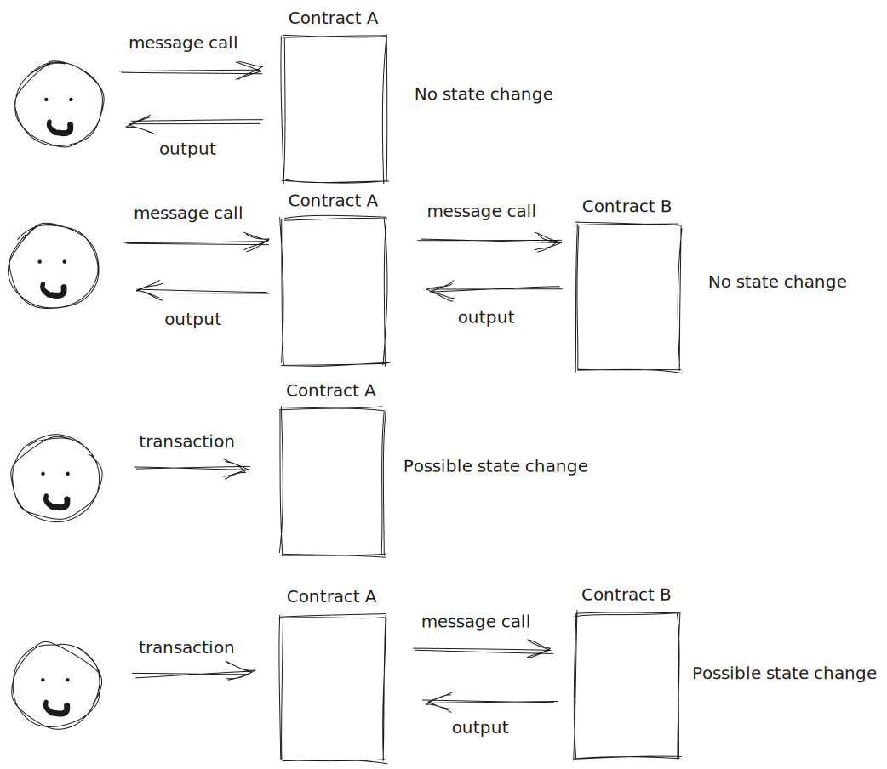

Figure 18 - Difference between message calls and transactions

In brief terms, message calls outside the context of a transaction (see the first two items in figure 17) do not alter the state of the blockchain. They serve a read-only purpose. On the other hand, message calls in the context of a transaction may change the state of the blockchain. Contracts always communicate between themselves using message calls and they only cause state to be changed if the message call is triggered by a transaction. A message call is a dry-run unless called from a transaction; then it becomes an actual real run that consumes gas and triggers state changes.

Message calls always return an output, whereas transactions never return an output. It is helpful to imagine the interactions of a transaction and a message call to understand the reasoning behind this. A transaction will eventually get included and executed whereas a message call must happen immediately. If person A issues a transaction to a contract, the transaction will eventually get executed and hence, it will eventually produce some logs. However, if a transaction calls contract A that calls contract B, then the call to contract B must return within the context of execution of the originating transaction. The transaction execution cannot wait until the eventual transaction to contract B is executed. As such, contract A does not issue a transaction to contract B, but a message call. The execution of this message call is run in the context of the transaction and its output is returned immediately for the originating transaction to proceed. 

> Note that we need to differentiate between the value that is to be transferred, v, from the value apparent in the execution context, $\tilde{v}$, for the `DELEGATECALL` instruction
> 

This statement refers to the subtle change in the behaviour of a `DELEGATECALL` instruction. `DELETEGATECALL` is used to execute the code of another account in the context of the current account. As such, the $\tilde{v}$ sent to the account with the contract code of interest is 0. All the endowment is preserved for the original account. 

**Part 1**

The first step in executing a message call is to reduce the sender’s balance by the value being sent, and incrementing the recipient’s balance by that same amount. Note that the implementation allows for the **recipient** to not initially exist. If the recipient address does not exist an $EMPTY$ account with the address of the recipient is created (with the initial value being the value being sent). Mathematically, the paper defines the transitional state, $\boldsymbol{\sigma}_1$ that is to be fed to the code-executing function $\Xi$ as:

(112)  $\boldsymbol{\sigma}_1 \equiv \boldsymbol{\sigma}_1'$  except

(113)  $`\boldsymbol{\sigma}_1[s] \equiv \begin{cases} \emptyset &\text{if} & \boldsymbol{\sigma}_1'[s]=\emptyset \space \land v = 0 \\ \boldsymbol{a}_1 & \text{otherwise} \end{cases}`$

Again, it is interesting that the paper defines the behaviour for a non-existing sender as the [validity function](https://www.notion.so/The-annotated-Ethereum-yellow-paper-af227a53325c478da74086edb4fc75bb?pvs=21) prohibits it. However, if the sender does exist then his balance is reduced by the value being sent

(114)  $\boldsymbol{a}_1 \equiv (\boldsymbol{\sigma}_1'[s]_n,\boldsymbol{\sigma}_1'[s]_b -v,\boldsymbol{\sigma}_1'[s]_s, \boldsymbol{\sigma}_1'[s]_c )$

The paper defines $\boldsymbol{\sigma}_1'$ in terms of the input state $\boldsymbol{\sigma}$

(115)  $\boldsymbol{\sigma}_1' \equiv \boldsymbol{\sigma}$  except

(116)  $`\begin{cases} \boldsymbol{\sigma}_1'[r] \equiv (0,v,TRIE(\emptyset), KEC(())) & \text{if} & \boldsymbol{\sigma}[r] = \emptyset \space \land v \neq 0 \\ \boldsymbol{\sigma}_1'[r] \equiv \emptyset & \text{if} & \boldsymbol{\sigma}[r]=\emptyset \space \land v=0 \\ \boldsymbol{\sigma}_1'[r] \equiv \boldsymbol{a}_1' & \text{otherwise}  \end{cases}`$  

The first clause of equation 116 shows that the recipient becomes an $EMPTY$ account in the case of the recipient not existing in the input state $\boldsymbol{\sigma}$ **and** the value being sent is non 0. If the value is 0, then the recipient is left as a non-existing account. Finally, if the recipient exists, then it is given by $\boldsymbol{a}_1'$  where the definition of $\boldsymbol{a}_1'$  is given in

(117)  $\boldsymbol{a}_1' \equiv (\boldsymbol{\sigma}[r]_n, \boldsymbol{\sigma}[r]_b + v, \boldsymbol{\sigma}[r]_s, \boldsymbol{\sigma}[r]_c)$

The state $\boldsymbol{\sigma}_1$ fully defined and it is used as input to the code-executing function $\Xi$

**Part 2**

In essence, part 2 is executing the account code of the message call account (or the delegated code for instructions `DELEGATECALL`, `CALLCODE`) using the flow explained in section 9. It is important to notice the existence of precompiles. These are, as explained [before](https://www.notion.so/The-annotated-Ethereum-yellow-paper-af227a53325c478da74086edb4fc75bb?pvs=21), virtual contracts that are executed outside of the EVM abstraction. 

# Section 9 - Execution Model

> The execution model specifies how the system state is altered given a series of bytecode instructions and a small tuple of environmental data
> 

Both the flow of [contract-creation](https://www.notion.so/The-annotated-Ethereum-yellow-paper-af227a53325c478da74086edb4fc75bb?pvs=21) and that of the [message call](https://www.notion.so/The-annotated-Ethereum-yellow-paper-af227a53325c478da74086edb4fc75bb?pvs=21) use the execution layer to interact with the EVM. Prior to the execution layer being interacted with, nothing changes in the state of the system.

## **9.1 Basics**

> The EVM is a simple stack-based architecture. The word size of the machine (and thus size of stack items) is 256-bit… The  stack has a maximum size of 1024 … The machine also has an independent storage model… The memory model is a simple word-addressed byte array … The machine also has an independent storage model; this is similar in concept to the memory but rather than a byte array, it is a word-addressable word array. Unlike memory, which is volatile, storage is non volatile and is maintained as part of the system state… All locations in both storage and memory are well-defined initially as zero.
> 

Visually, we have the stack:

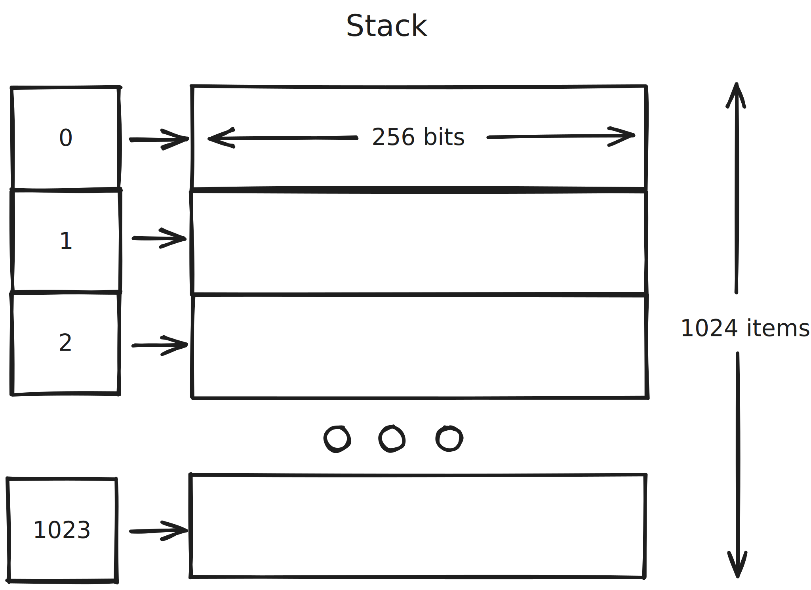

Figure 19 - The stack model of the EVM

It has a maximum size of 1024 words (a word is a 32 byte element). EVM opcodes consume items from the stack as input and output the result back onto the stack. For example the opcode `ADD` will add the first two items from the stack (position 0 and position 1) and store the result in position 0. 

Visually, we have the memory model:

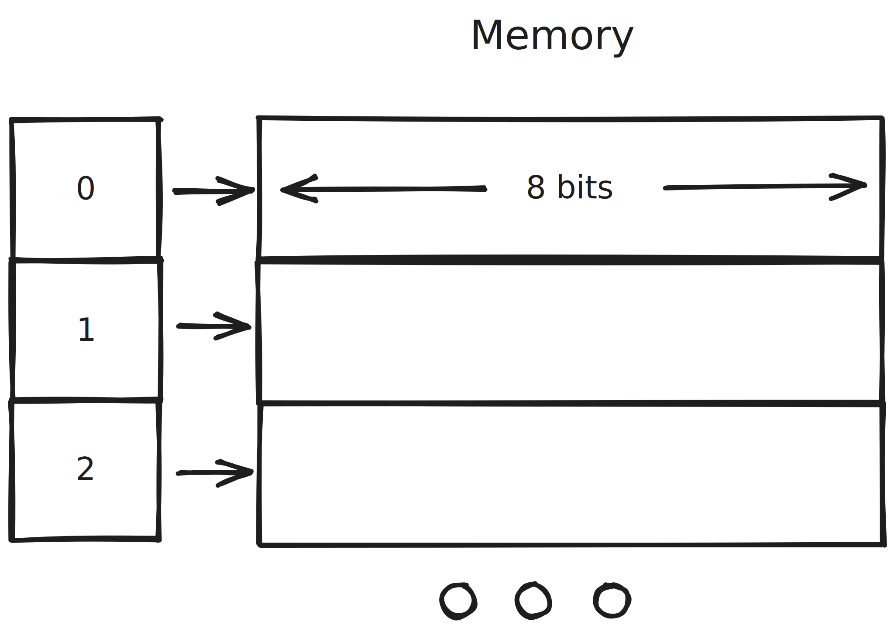

Figure 20 - The memory of the EVM

The memory is a **word-addressable** **byte array**. It is infinite in size but gas must be paid for all memory usage. The gas paid is linear up until 724 bytes - it becomes quadratic after that. Note also that memory is volatile. Anything stored will be discarded after execution finishes.

Visually, we have the storage model:

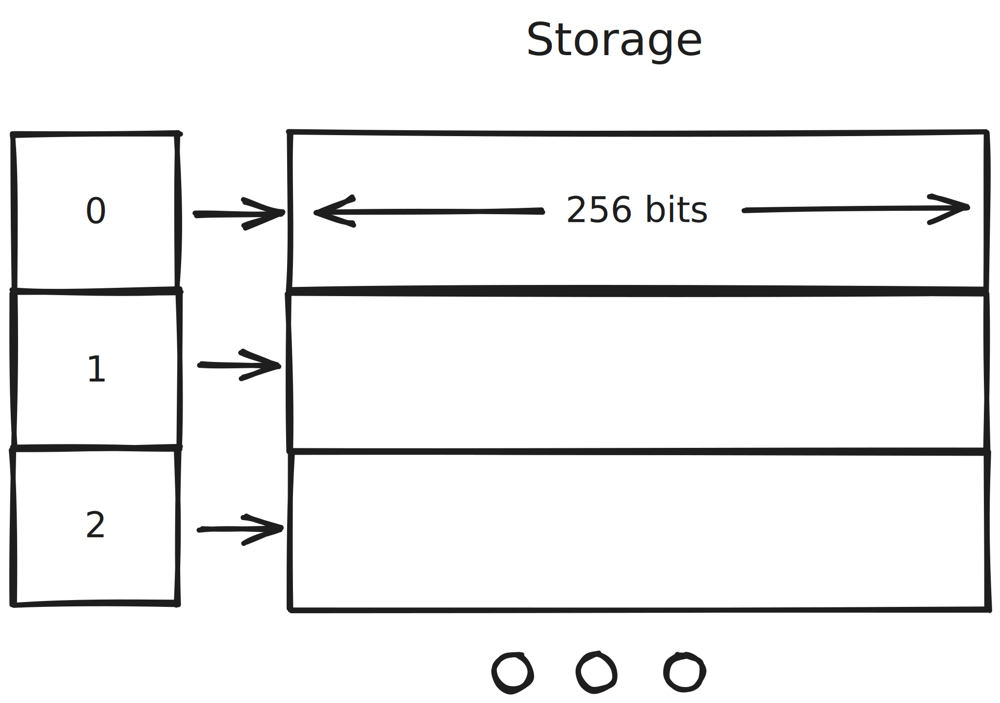

Figure 21 - The storage of the EVM

The storage is a non-volatile word-addressable word-array that is kept as part of the system state. The storage is also infinite in size, but gas must be paid to permanently store items in the system state. 

> The machine can have exceptional execution for several reasons, including stack underflows and invalid instructions. Like the out-of-gas exception, they do not leave state changes intact. Rather, the machine halts immediately and reports the issue to the execution agent (either the transaction processor or, recursively, the spawning execution environment) which will deal with it separately
> 

It is interesting to note that the notion of not modifying the state - in the case of an exception being thrown - is not part of the code-executing logic. It is the responsability of what the paper refers to as the execution agent. The execution agent can be thought of as the flow that called the code-executing transaction. Trivially it may be the transaction processor (when a transaction directly calls the code-executing function). However, transactions can result in contracts calling other contracts. The call is dealt with in a recursive manner. All of the input data is defined, and the output is returned as if the execution spawned from the contract call is itself an independent transaction. As such, the paper states that it is the responsability of the contract that called the contract to ensure the state is maintained as before if the call itself was invalid. In other words, if person A calls contract B which issues a call that fails to contract C, person A can assume that the state returned by contract B has not been modified by the call to contract C. 

## **9.2 Fees Overview**

This subsection describes when gas is charged.

1. Fee intrinsic to the computation of an operation - This is the fee association with an opcode such as `ADD` - all the fees associated with all available opcodes is given in appendix G of the paper
2. Gas is charged for the payment associated with a subordinate message call or contract creation - During code-execution, if an opcode is encountered that results in a message call or contraction creation - the call itself is charged (as issuing calls / contract-creations costs gas)
3. Increase in the usage of memory - This is for the **memory** model and **storage** model **only**. Usage of the stack is completely free. Note that freeing the non-volatile storage model by deleting contents from it results in gas being refunded.

## **9.3 Execution Environment**

The input to the code-executing function $\Xi$ is:

1. $I_a$ - the address that owns the code that is being executed. Note that code can be executing inside the context of another account with instructions such as `DELEGATECALL`. 
2. $I_o$ - the sender address of the transaction that originated this execution - note that this is different to $I_s$. If person A calls contract B that calls contract C, then the code-executing function - in the context of the final call to contract C - will have $I_o$ as contract B, but $I_s$ as person A.
3. $I_p$ - the price of gas in the transaction that originated this execution
4. $I_{\boldsymbol{d}}$ - the byte array that is the input data to this execution
5. $I_s$ - the address of the account which caused the code to be executing - note the difference with $I_o$
6. $I_v$ - the value, in $Wei$ passed to this account
7. $I_{\boldsymbol{b}}$ - the byte array that is the machine code to be executed
8. $I_H$ - the block header of the present block
9. $I_e$ - the depth of the present message-call or contract creation - if person A calls contract B that calls contract C then the code-executing function - in the context of the final call to contract C - will have $I_e$ as 3
10. $I_w$ - the permission to make modifications to the state. This is equivalent to the `static` keyword in solidity. No call that has $I_w$ as `false` may modify any persistent state. Usually calls like these are read only. 

## **9.4 Execution Overview**

The code-executing function $\Xi$ is defined as a recursive process - involving several other functions

- $O$ - this function defines the result of a single cycle of the EVM
- $Z$ - this function determines if the present state is an exceptional halting state of the machine
- $H$ - this function determines the output **if and only if** the present state is a normal halting state of the machine - Note that this function evalutes to the empty set $\emptyset$ if the current state is not a normal halting state and to an array (possibly empty) - $()$ -  if the present state is indeed a normal halting state. The key take-away is that $() \neq \emptyset$ (an output of $()$  represents a normal halting state output whereas $\emptyset$ does not

Using the definitions from above, the code-executing function $\Xi$ is defined in terms of $X$

$\Xi (\boldsymbol{\sigma}, g, A, I) \equiv X(\boldsymbol{\sigma}, \boldsymbol{\mu}, A, I)$ 

Before formalising $X$ it is helpful to understand its inputs and the functions $O, Z$ and $H$.

Quantities such as $\boldsymbol{\sigma}$ - the [world state](https://www.notion.so/The-annotated-Ethereum-yellow-paper-af227a53325c478da74086edb4fc75bb?pvs=21), $A$ - the [accrued substate](https://www.notion.so/The-annotated-Ethereum-yellow-paper-af227a53325c478da74086edb4fc75bb?pvs=21), and $I$ - the [input](https://www.notion.so/The-annotated-Ethereum-yellow-paper-af227a53325c478da74086edb4fc75bb?pvs=21) to the code-executing function are well defined. The machine state $\boldsymbol{\mu}$ is the tuple comprising of the following:

1. $\boldsymbol{\mu}_g$ - gas available for execution
2. $\boldsymbol{\mu}_{pc}$ - the program counter - used to index $I_b$
3. $\boldsymbol{\mu}_{\boldsymbol{m}}$ - the [memory](https://www.notion.so/The-annotated-Ethereum-yellow-paper-af227a53325c478da74086edb4fc75bb?pvs=21)
4. $\boldsymbol{\mu}_i$ - the active number of words in [memory](https://www.notion.so/The-annotated-Ethereum-yellow-paper-af227a53325c478da74086edb4fc75bb?pvs=21) - as the memory is initially well defined as being all 0s - the element $\boldsymbol{\mu}_i$ helps distuinguish what is being held in memory (possibly a series of 0s) and what is not (the series of 0s initially defined like so)
5. $\boldsymbol{\mu}_{\boldsymbol{s}}$ - the [stack](https://www.notion.so/The-annotated-Ethereum-yellow-paper-af227a53325c478da74086edb4fc75bb?pvs=21) contents
6. $`\boldsymbol{\mu}_{\boldsymbol{o}}`$ - the program output. When contract A calls contract B, the output of the call gets stored in $`\boldsymbol{\mu}_{\boldsymbol{o}}`$. For contract A to access this output, it must issue a `RETURNDATACOPY` instruction - this copies the contents of $`\boldsymbol{\mu}_{\boldsymbol{o}}`$ into $`\boldsymbol{\mu}_{\boldsymbol{m}}`$. By doing this, contract A can now act on the returned data from the call to contract B

The machine state $\boldsymbol{\mu}$ fed into the function $X$ as part of the definition of the code-executing function $\Xi$ is defined as follows

(137)  $\boldsymbol{\mu}_g \equiv g$

The available gas for execution is the remaining gas fed into the code-executing function $\Xi$

(138)  $\boldsymbol{\mu}_{pc} \equiv 0$

The program counter starts at the first instruction of the code $I_b$

(139)  $\boldsymbol{\mu}_{\boldsymbol{m}} = (0,0,...)$

The memory is defined as all 0s 

(140)  $\boldsymbol{\mu}_i\equiv0$

There are currently no active words in memory

(141)  $\boldsymbol{\mu}_s \equiv 0$

The stack is empty

(142)  $\boldsymbol{\mu}_{\boldsymbol{o}} \equiv ()$

The output is empty.

To understand $O, Z$ and $H$ the paper defines the current instruction as 

(148)  $`w \equiv \begin{cases} I_b[\boldsymbol{\mu}_{pc}] & \text{if} & \boldsymbol{\mu}_{pc} < ||I_b|| \\ STOP & \text{otherwise} \end{cases}`$

In simple terms, the current instruction is defined as the instruction at index $\boldsymbol{\mu}_{pc}$ in the program code $I_b$. If the program counter tries to index outside the range of the program code $I_b$ the paper defines the instruction to simply be $STOP$.

With the definition of the current instruction the paper formalizes the remaining ideas

1. $Z$ - **exceptional halting function**

The function is defined in equation 149

(149)  $`Z(\boldsymbol{\sigma}, \boldsymbol{\mu}, A, I) \equiv \boldsymbol{\mu}_g < C(\boldsymbol{\sigma}, \boldsymbol{\mu},A,I) \space \lor \\ \delta_w = \emptyset \space \lor \\ ||\boldsymbol{\mu}_s|| < \delta_w \space \lor \\ (w = JUMP \space \land \boldsymbol{\mu}_s[0] \notin D(I_b)) \space \lor \\ (w = JUMP1) \space \land \boldsymbol{\mu}_s[1]\neq 0 \space \land \boldsymbol{\mu}_s[0] \notin D(I_b)) \space \lor \\  (w = RETURNDATACOPY \space \land \boldsymbol{\mu}_s[1] + \boldsymbol{\mu}_s[2] > ||\boldsymbol{\mu}_o||) \space \lor  \\ ||\boldsymbol{\mu}_s|| - \delta_w + \alpha_w > 1024 \space \lor \\ (\neg I_w \space \land W(w,\boldsymbol{\mu})) \space \lor \\ (w = SSTORE \space \land \boldsymbol{\mu}_g \leq G_{\text{callstipend}})`$

Let’s go through the lines one-by-one. The current state is an exception halting state if

- $\boldsymbol{\mu}_g < C(\boldsymbol{\sigma}, \boldsymbol{\mu},A,I)$
    
    The gas available is less than the gas required to execute the next instruction
    
- $\delta_w = \emptyset$
    
    Every instruction $w$ has associated with it the following two quantities: 
    
    1. $\delta_w$ - the number of arguments it will pop from the stack
    2. $\alpha_w$ - the number of arguments it will push onto the stack
    
    The number of arguments an instruction will pop from the stack $\delta_w$ corresponds to the arguments an instruction/opcode expects. For example instruction `ADD` expects two arguments to add.  If an instruction $w$ has $\delta_w = \emptyset$ or $\alpha_w = \emptyset$ then the instruction is not defined. It is an invalid instruction. Hence, the current state is an exceptional halting state if the next instruction is an invalid instruction 
    
- $||\boldsymbol{\mu}_s|| < \delta_w$
    
    As mentioned above, $\delta_w$ is the number of items the instruction will pop from the stack. If the stack size is smaller then the current state is an exceptional halting state
    
- $(w = JUMP \space \land \boldsymbol{\mu}_s[0] \notin D(I_b))$
    
    If the current instruction is `JUMP` and the jump destination $\boldsymbol{\mu}_s[0]$ - the first item on the stack - is an invalid jump destination. This is more formally defined later on once the jump destination validity set $D(I_b)$ is defined.
    
- $(w = JUMP1) \space \land \boldsymbol{\mu}_s[1]\neq 0 \space \land \boldsymbol{\mu}_s[0] \notin D(I_b))$
    
    `JUMP1` is a conditional jump. What the condition above states is that the current state is an exceptional halting state if the condition for jumping is true $\boldsymbol{\mu}_s[1]\neq0$ - the second item on the stack is not equal to 0 - and the jump destination $\boldsymbol{\mu}_s[0]$ - the first item on the stack - is an invalid jump destination.
    
- $(w = RETURNDATACOPY \space \land \boldsymbol{\mu}_s[1] + \boldsymbol{\mu}_s[2] > ||\boldsymbol{\mu}_o||)$
    
    The current instruction `RETURNDATACOPY` tries to copy $\boldsymbol{\mu}_s[2]$  bytes starting at index $\boldsymbol{\mu}_s[1]$ from the output $\boldsymbol{\mu}_o$ into the internal memory $\boldsymbol{\mu}_m$. The current state is an exceptional halting state if the instruction results in an *out-of-index* exception (If one tries to copy outside the range of the array $\boldsymbol{\mu}_o$. 
    
- $||\boldsymbol{\mu}_s|| - \delta_w + \alpha_w > 1024$
    
    The current instruction would cause a stack overflow.
    
- $(\neg I_w \space \land W(w,\boldsymbol{\mu}))$
    
    The current instruction attempts to modify the state when the transaction does not have such a permission (a static call). The function $`W(w, \boldsymbol{\mu})`$ returns true if the current instruction is a state-modifying instruction:
    
- $(w = SSTORE \space \land \boldsymbol{\mu}_g \leq G_{\text{callstipend}})$
    
    The current instruction tries to save a word (32 bytes) to memory. The current state is an exceptional halting state if the remaining gas is not enough to pay for the memory storage associated with storing a word. 
    

As mentioned above, `JUMP` and `JUMP1` instructions may result in exceptional halting states in the event that the jump destination is not in the jump destination validity set $D(I_b)$ - note that the function that returns the validity set is $D$. We feed the current program code $I_b$ to extract the validity set for the given code. 

(151)  $D(\boldsymbol{c}) \equiv D_J(\boldsymbol{c}, 0)$

The function $D_J(\boldsymbol{c},i)$  is a recursive function - formally defined in equation 152 (Note that $D$ simply calls $D_J$ from position 0 - starts the recursion from position 0.

(152)  $`D_J(\boldsymbol{c},i) \equiv \begin{cases} \{\} & \text{if} & i \geq ||\boldsymbol{c}|| \\ \{i\}\cup D_J(\boldsymbol{c}, N(i, \boldsymbol{c}[i])) & \text{if} & \boldsymbol{c}[i] = \text{JUMPDEST} \\ D_J(\boldsymbol{c}, N(i, \boldsymbol{c}[i])) & \text{otherwise}  \end{cases}`$

The function $D_J$ returns a set of indices corresponding to positions in the program code $I_b$ marked with the special instruction $`\text{JUMPDEST}`$. Consider the following program:


Figure 22 - A program code with 2 `JUMPDEST` instructions

Function $D_J$ would only enter case 2 of the recursive process (where it returns the index position) at index 2 and index 190. Once it reaches index 191, the recursive process stops as the index is equal to the size of the program $\boldsymbol{c}$. Special care must be taken when program code includes the set of `PUSH` instructions. A `JUMPDEST` instruction many not reside in the *data* portion of a `PUSH` instruction. Consider the set of program code given in figure 23.


Figure 23 - 3 program codes illustrating positions where a `JUMPDEST` instruction may not reside as a result of a `PUSH` instruction

A `JUMPDEST` may not reside in any of the red shaded positions from figure 23. This is because those positions correspond to the *data* positions of a `PUSH` instruction. `PUSH1` will push the cell immediate after onto the stack - hence a `JUMPDEST` may not reside there. `PUSH2` will push the next 2 cells onto the stack - hence a `JUMPDEST` may not reside in any of the 2 positions after. To handle this slight caveat the function $N(i,w)$ given in equation 153 is used.

(153)  $`N(i,w) \equiv \begin{cases} i + w - PUSH1 + 2 & \text{if} & w \in [PUSH1,PUSH32] \\ i + 1 & \text{otherwise} \end{cases}`$

What this function does is it returns the closest index after the input index $i$ that corresponds to a position that is not in the *data* part of a `PUSH` instruction. 

1. $H$ - **Normal halting function**

The paper defines the normal halting function $H$ in equation 154

(154) $`H(\boldsymbol{\mu},I) \equiv \begin{cases} H_{\text{RETURN}}(\boldsymbol{\mu}) & \text{if} & w\in\{{\text{RETURN},\text{REVERT}}\} \\   () & \text{if} & w\in\{\text{STOP},\text{SELFDESTRUCT}\} \\ \emptyset & \text{otherwise} \end{cases}`$

The function returns $\emptyset$ if the current instruction is not a *normal* halting instruction. The set of ******normal****** halting instructions is the set comprised of the 4 instructions $\{\text{RETURN},\text{REVERT}, \text{STOP}, \text{SELFDESTRUCT}\}$. Out of the 4, equation 154 tells us that only 2 $\{\text{RETURN}, \text{REVERT}\}$ will return data, whereas the other 2 $\{\text{STOP}, \text{SELFDESTRUCT}\}$ return the empty array $()$.  

$H_{RETURN}$ is defined in section H for both `RETURN` and `REVERT`. For both, the returned data is 

 $`H_{RETURN}(\boldsymbol{\mu}) \equiv \boldsymbol{\mu}_{\boldsymbol{m}}[\boldsymbol{\mu}_{\boldsymbol{s}}[0]...(\boldsymbol{\mu}_{\boldsymbol{s}}[0] + \boldsymbol{\mu}_{\boldsymbol{s}}[1] - 1)]`$ 

In words, we return the memory contents in the range given by the first stack element and the second stack element.

1. $O$ - **Single cycle function**

The paper defines the single cycle function $O$ using equation 155 through to equation 164

(155)  $O((\boldsymbol{\sigma}, \boldsymbol{\mu}, A, I)) \equiv (\boldsymbol{\sigma}',\boldsymbol{\mu}', A', I')$

(156)  $\Delta \equiv \alpha_w - \delta_w$

The overall change in items on the stack is the number of items pushed $\alpha_w$ minus the number of items popped $\delta_w$

(157)  $||\boldsymbol{\mu}_s'|| \equiv ||\boldsymbol{\mu_s}|| + \Delta$

The size of the new stack is the size of the previous stack plus the overall change defined in equation 156

(158)  $\forall x \in [\alpha_w, ||\boldsymbol{\mu}_s'||): \boldsymbol{\mu}_s' \equiv \boldsymbol{\mu}_s[x-\Delta]$

All the items already on the stack will be shifted based on the overall stack change $\Delta$

(159)  $\boldsymbol{\mu}_g' \equiv \boldsymbol{\mu}_g - C(\boldsymbol{\sigma},\boldsymbol{\mu},A,I)$

The gas will be reduced by the current instruction gas cost

(160)  $`\boldsymbol{\mu}_{pc}'\equiv \begin {cases} J_{JUMP}(\boldsymbol{\mu}) & \text{if} & w = JUMP \\ J_{JUMP1}(\boldsymbol{\mu}) & \text{if} & w = JUMP1 \\ N(\boldsymbol{\mu}_{pc},w) & \text{otherwise} \end{cases}`$

The program counter will be updated accordingly if the next instruction is $`w \in \{JUMP, JUMP1\}`$ - to point to the valid `JUMPDEST` that resides at $`\boldsymbol{\mu}_s[0]`$ or to the next valid instruction $`N(\boldsymbol{\mu}_{pc},w)`$ - jumping through the *data* part of a `PUSH` instruction.

The paper also says that - **in general** - we may assume the following remain unchanged

(161)  $\boldsymbol{\mu}_m' \equiv \boldsymbol{\mu}_m$

The memory contents remain unchanged

(162)  $\boldsymbol{\mu}_i' \equiv \boldsymbol{\mu}_i$

The number of active words in memory remains unchanged

(163)  $A' \equiv A$

The accrued substate remains unchanged

(164)  $\boldsymbol{\sigma}' \equiv \boldsymbol{\sigma}$

The world state remains unchanged

Note that exception to this generality are instructions that either change the state, add to memory, or produce logs. 

---

With the exceptional halting state function $Z$, normal halting state function $O$, and the single cycle function $O$, the paper defines the recursive process that is code execution in equation 143

(143)  $`X((\boldsymbol{\sigma},\boldsymbol{\mu}, A, I)) \equiv \begin{cases} (\emptyset, \boldsymbol{\mu}, A, I, \emptyset) & \text{if} & Z(\boldsymbol{\sigma}, \boldsymbol{\mu}, A,I) \\ (\emptyset, \boldsymbol{\mu}',A,I,\boldsymbol{o}) & \text{if} & w = REVERT \\ O(\boldsymbol{\sigma}, \boldsymbol{\mu}, A, I) \cdot \boldsymbol{o} & \text{if} & \boldsymbol{o} \neq \emptyset \\ X(O(\boldsymbol{\sigma},\boldsymbol{\mu}, A, I)) & \text{otherwise}  \end{cases}`$

Let’s break it down line by line

1. $(\emptyset, \boldsymbol{\mu}, A, I, \emptyset) \quad \text{if} \quad Z(\boldsymbol{\sigma}, \boldsymbol{\mu}, A,I)$

In the case of an exceptional halting state, $X$returns an empty world state and an empty output

1. $(\emptyset, \boldsymbol{\mu}',A,I,\boldsymbol{o}) \quad \text{if} \quad w = REVERT$ 

In the case of a `REVERT` , $X$ returns an empty world state but output given by $\boldsymbol{o} \equiv H(\boldsymbol{\mu},w)$. Note that we know [from the definition of the normal halting state function](https://www.notion.so/The-annotated-Ethereum-yellow-paper-af227a53325c478da74086edb4fc75bb?pvs=21) $H$ that the returned value is $H_{RETURN}$.

1. $O(\boldsymbol{\sigma}, \boldsymbol{\mu}, A, I) \cdot \boldsymbol{o} \quad \text{if} \quad \boldsymbol{o} \neq \emptyset$

In the case that the normal halting state function returns true (the current state is a normal halting state) we return the output of $O$. Note that this can either be $H_{RETURN}$ if $w$  = `REVERT` or the empty array $()$ otherwise.

1. $X(O(\boldsymbol{\sigma},\boldsymbol{\mu}, A, I)) \quad \text{otherwise}$ 

In all other scenarios, we are not at a halting state (normal or exceptional) so we keep executing the code.

With all the definitions above, the paper has formalised the code execution of the EVM.

# Section 11 - Block finalisation

Block finalisation is a 4 step process:

## 11.1 Ommer Validation

As mentioned [before](https://www.notion.so/The-annotated-Ethereum-yellow-paper-af227a53325c478da74086edb4fc75bb?pvs=21), block headers contain a list of ommer block headers. Miners get rewarded for including such ommer block headers as will be seen in section [11.3](https://www.notion.so/The-annotated-Ethereum-yellow-paper-af227a53325c478da74086edb4fc75bb?pvs=21). To determine if the block headers included in a block are valid one must check two things - given in equation 167

(167)  $`||B_{\boldsymbol{U}}|| \leq 2 \space \land_{\boldsymbol{U} \in B_{\boldsymbol{U}}} V(\boldsymbol{U}) \space \land k(\boldsymbol{U}, P(\boldsymbol{B_{\boldsymbol{H}_{}}})_{\boldsymbol{H}}, 6)`$

In words, only 2 ommer block headers may be included and indeed the headers must be valid. To determine their validity, the *is-kin* function is given in equation 168

(168)  $`k(U, H, n) \equiv \begin{cases} false & \text{if} & n = 0 \\ s(U,H) \space \lor k(U, P(H)_H, n -1) & \text{otherwise} \end{cases}`$

In words, the *is-kin* function is a function that checks the *is-sibling function* $s(U,H)$ at different levels - given by $n$. Let’s look at the *is-sibling function*

(169)  $`s(U,H) \equiv (P(H) = P(U) \space \land H \neq U \space \land U \notin B(H)_U)`$

The *is-sibling* function returns true if the parent of block $U$ is equal to the parent of block $H$, with the caveat that the blocks cannot be the same and $U$ cannot be in the ommer list of block $H$. The last condition is to prevent having the same block repeated twice as an ommer block. Visually, what the *is-sibling* does is shown in figure 24. 

 

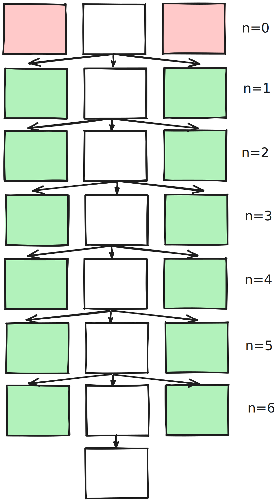

Figure 24 - A visualization of the possible Ommer blocks for a given block as determined by the *is-sibling* function

 By crawling up 6 levels, it determines that any of the green shaded blocks may be present in the ommer list of the latest block. However, any blocks above 6 levels are not valid - see the red shaded blocks.

## 11.2 Transaction Validation

The transaction validation part of the block finalization check is a simple one

(170)  $B_{H_g} = l(\boldsymbol{R})_u$

The total gas used in the block $B_{H_g}$ must be equal to the [cumulative gas used](https://www.notion.so/The-annotated-Ethereum-yellow-paper-af227a53325c478da74086edb4fc75bb?pvs=21) as given in the last transaction receipt of the receipt array $\boldsymbol{R}$ 

## 11.3 Reward Application

Reward is given to the block beneficiary $B_{H_c}$ and to all ommer block beneficiaries. The paper defines the reward application function $\Omega$

(171)  $\Omega(B, \boldsymbol{\sigma}) \equiv \boldsymbol{\sigma}' : \boldsymbol{\sigma}' = \boldsymbol{\sigma}$ except

(172)  $`\boldsymbol{\sigma}'[\boldsymbol{B}_{H_c}]_b = \boldsymbol{\sigma}[\boldsymbol{B}_{H_c}] + (1 + \frac{||\boldsymbol{B_{\boldsymbol{U}}}||}{32})R_{block}`$

The block beneficiary is rewarded $R_{block}$ for commiting the block, and $\frac{R_{block}}{32}$ for every ommer header included (note that a [maximum of 2 may be included](https://www.notion.so/The-annotated-Ethereum-yellow-paper-af227a53325c478da74086edb4fc75bb?pvs=21)). 

(173)  $`\forall \boldsymbol{U} \in \boldsymbol{B}_{\boldsymbol{U}}: \boldsymbol{\sigma}'[\boldsymbol{U}_c] = \begin{cases} \emptyset & \text{if} & \boldsymbol{\sigma}[\boldsymbol{U}_c]  = \emptyset \space \lor R = 0 \\ \boldsymbol{a}' & \text{otherwise} \end{cases}`$

(174)  $\boldsymbol{a}' \equiv (\boldsymbol{\sigma}[U_c]_n, \boldsymbol{\sigma}[U_c]_b + R, \boldsymbol{\sigma}[U_c]_s, \boldsymbol{\sigma}[U_c]_c)$

For the ommer block beneficiaries, a reward $R$ is given if the beneficiary account exists. The paper defines $R$ in equation 175

(175)  $R \equiv (1 + \frac{1}{8}(U_i - B_{H_i}))R_{block}$

Interestingly, we see that the further an ommer is from the current block number, the bigger the reward. Consider figure 25. 

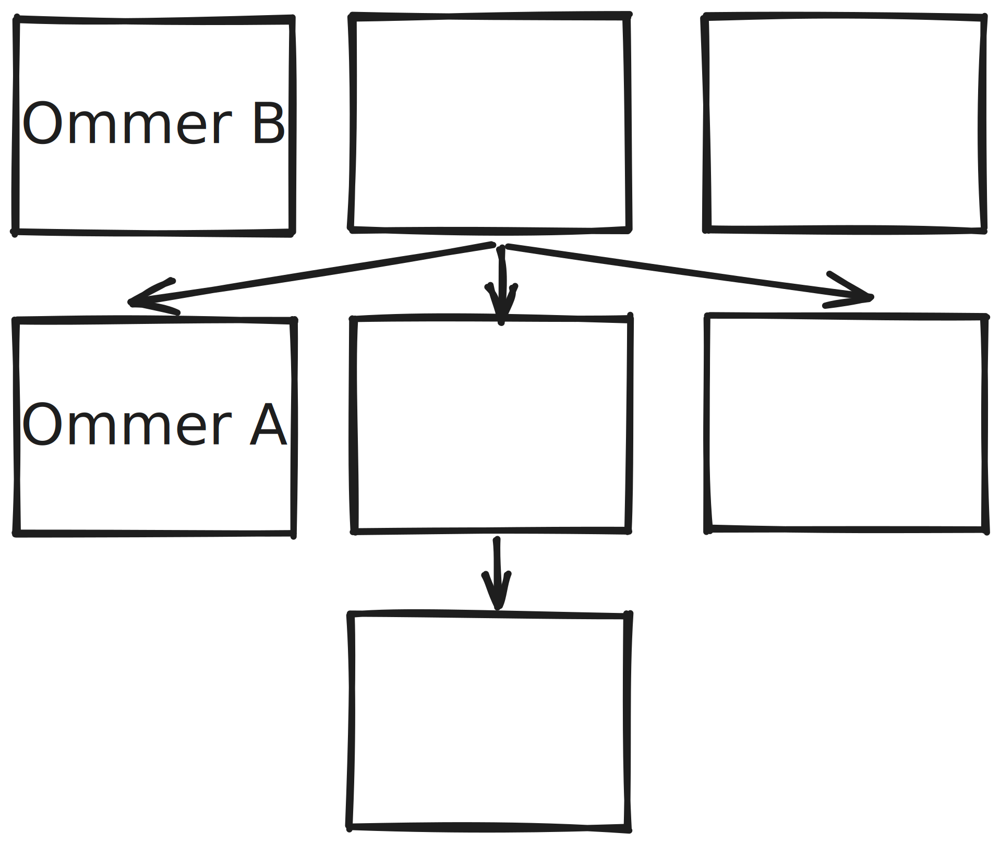

Figure 25 - Including Ommer B is more valuable than including Ommer A

It is more valuable to a miner to include ommer B than ommer A, as the difference in block number $U_i - B_{H_i}$ is bigger.

The quantity $R_{block}$ is well defined in equation 176

(176)  $`R_{block} = 10^{18} \times \begin{cases} 5 & \text{if} & H_i < F_{Byzantium} \\ 3 & \text{if}  & F_{Byzantium} \leq H_i \leq F_{Constantinople} \\ 2 & \text{if} & H_i \geq F_{Constantinople} \end{cases}`$

We see that the reward per block has decreased across the periods of existence. 

One reason for having ommer blocks is that their inclusion adds to the total amount of work done on the canonical chain.

## 11.4 State & Nonce Validation

The nonce validation is left out of scope for this annotation as Ethereum has transitioned to PoW. (These are equations 178 - 181). 

For state validation the paper defines a handful of indexable quantities.

(182)  $`\boldsymbol{\sigma}[n] = \begin{cases} \Gamma(B) & \text{if} & n < 0 \\ \Upsilon (\boldsymbol{\sigma}[n-1], B_{\boldsymbol{T}}[n]) & \text{otherwise}  \end{cases}`$

Equation 182 defines an indexable state array - indexable for each transaction included in the block. For example, $\boldsymbol{\sigma}[0]$  represents the state before the first transaction changes the state - this quantity is given by $\Gamma(B)$. $\boldsymbol{\sigma}[1]$ gives the state after the first transaction has been applied etc… (we remember that $\Upsilon$ is the [transaction transition function](https://www.notion.so/The-annotated-Ethereum-yellow-paper-af227a53325c478da74086edb4fc75bb?pvs=21))

(183)  $`\boldsymbol{R}[n]_u = \begin{cases} 0 & \text{if} & n < 0 \\ \Upsilon^g(\boldsymbol{\sigma}[n-1], B_{\boldsymbol{T}}[n] + \boldsymbol{R}[n-1]_u & \text{otherwise} \end{cases}`$

Equation 183 gives us an indexable cumulative gas usage  - indexable for each transaction included in the block. (we remember that $\boldsymbol{R}$ is the transaction receipt array and that $\Upsilon^g$ is the gas used in executing a single transaction. For example $\boldsymbol{R}[2]_u$ will give us the gas used in transactions 1 and 2.

(184)  $`\boldsymbol{R}[n]_l = \Upsilon^l(\boldsymbol{\sigma}[n-1], B_{\boldsymbol{T}}[n])`$

Equation 184 gives us an indexable log array - indexable for each transaction included in the block. For example, $\boldsymbol{R}[4]_l$ will give us the logs produced by applying the $4^{\text{th}}$ transaction.

(185)  $`\boldsymbol{R}[n]_z = \Upsilon^z(\boldsymbol{\sigma}[n-1], B_{\boldsymbol{T}}[n])`$

Equation 185 gives us an indexable transaction status array - indexable for each transaction included in the block. For example, $\boldsymbol{R}[4]_z$ will give us the status code of the $4^{\text{th}}$ transaction.

The reason why this section is called state validation is because using the quantities defined above, one may validate what one may expect.

# Conclusion

This annotated version of the Ethereum yellow paper aims to clarify concepts that, at first, may come across as in need of a further dive. If anything is wrong, or the reader feels that certain parts might be clarified another way then I encourage the reader to do so. Understanding the Ethereum Yellow Paper is an important step in furthering our ecosystem.
